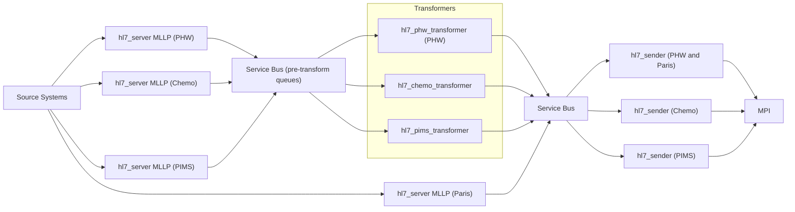

# Integration Hub - Beta

A cloud-native platform for seamless and secure exchange of clinical information between disparate digital health systems within NHS Wales.

## Table of Contents

- [Overview](#overview)
- [Mission and Key Objectives](#mission-and-key-objectives)
- [Architecture](#architecture)
- [Repository Structure](#repository-structure)
- [Core Components](#core-components)
- [Technology Stack](#technology-stack)
- [Local Setup](#local-setup)
- [Development](#development)
- [Deployment](#deployment)
- [Security & Compliance](#security--compliance)
- [Contributing](#contributing)

## Overview

NHS Wales requires a modern solution to connect digital health systems that use incompatible data formats and standards. The Integration Hub is a cloud-native platform providing robust data validation and transformation capabilities to enable the seamless and secure exchange of sensitive clinical information.

This internally-owned product replaces proprietary systems, unlocking agility, reducing costs, and ensuring data flows reliably between internal (NHS Wales) and third-party products to support patient care.

## Mission and Key Objectives

> [!TIP]
> For more information, view the [product brief](https://gigcymru.github.io/product-briefs/integration-hub/)

The Integration Hub facilitates the move to a clean, open, and secure-by-design architecture, enables the decommissioning of legacy data centres by being cloud-native, and provides the essential mechanism for data to flow into the National Data Resource (NDR) where services are unable to integrate directly (the preferred approach).

## Architecture

The Integration Hub follows a microservices architecture with event-driven messaging:

1. **HL7 Servers** receive messages from source systems
2. **Transformers** convert messages to target formats such as HL7 v2.5
3. **Message Bus** provides reliable message routing
4. **Senders** deliver transformed messages to destination systems such as PIMS

### Integration Patterns

- **Direct Integration**: Preferred approach where services can integrate directly with the National Data Resource (NDR)
- **Hub-Mediated Integration**: For legacy systems that cannot integrate directly, the Integration Hub facilitates data flow to the NDR
- **Legacy System Bridge**: Enables gradual migration from legacy data centres to cloud-native solutions

> [!NOTE]
> For a more detailed overview of the architecture, see the [wiki](https://dev.azure.com/NHS-Wales-Digital/Integration%20Hub/_wiki/wikis/Integration-Hub.wiki/5205/Architecture) **(Internal-only resource)**

### How it works (high-level)



## Repository Structure

```
Integration-Hub-Beta/
├── README.md                    # This file
├── TRAINING.md                  # Comprehensive training documentation
├── .gitignore                   # Git ignore rules
├── .github/                     # GitHub workflows and configurations
├── ca-certs/                    # Custom CA certificates for corporate networks
├── shared_libs/                 # Shared libraries used across services
│   ├── event_logger_lib/        # Azure Monitor event logging
│   ├── field_utils_lib/         # HL7 field parsing utilities
│   ├── health_check_lib/        # Common health check functionality
│   ├── hl7_validation/          # HL7 schema validation
│   ├── message_bus_lib/         # Service Bus communication library
│   ├── metric_sender_lib/       # Azure Monitor metrics
│   ├── processor_manager_lib/   # Message processing management
│   └── transformer_base_lib/    # Base transformer classes
├── local/                       # Local development environment
├── pipeline-ado/                # Azure DevOps pipeline configurations
├── network_test_app/            # Network connectivity testing utility
└── [Service Components]/        # Individual microservices (see below)
```

## Core Components

### HL7 Services

The platform handles HL7 message processing through specialized microservices:

**`hl7_server/`**

- Generic HL7 message receiving server via TCP/MLLP. Also provides acknowledgment responses back to source systems. Other server variants for different business flows (PHW, Paris, Chemocare, PIMS, etc.) reuse or extend this service to implement flow-specific logic while keeping common behaviour centralized.

**`hl7_phw_transformer/`**

- PHW (Public Health Wales) message transformation service.
- Subscribes to PHW-specific messages from the service bus and transforms relevant datetime fields to an MPI format.

**`hl7_chemo_transformer/`**

- Chemocare system message transformation service.
- Subscribes to Chemocare-specific messages from the service bus and transforms them to the HL7v2.5 format by applying Chemocare-specific business rules and data mappings, including mappings from the WRDS (Welsh Reference Data Service.)

**`hl7_pims_transformer/`**

- PIMS (Patient Information Management System) message transformation service.
- Subscribes to PIMS-specific messages from the service bus and transforms them to the HL7v2.5 format by applying PIMS-specific business rules and data mappings, including mappings from the WRDS.

**`hl7_sender/`**

- Message delivery service to target systems (primarily MPI - Master Patient Index).
- Handles connection management and retry logic for reliable delivery.
- Provides delivery confirmation and error handling.

**`hl7_mock_receiver/`**

- Mock receiver for testing and development.
- Simulates target system endpoints (e.g. MPI).
- Provides a realistic testing environment for end-to-end validation.

**`network_test_app/`**

- Network connectivity testing utility.
- Used for validating network paths, firewall rules, and endpoint accessibility.
- Helps diagnose connectivity issues in Azure Container Apps environments.

Each transformer is specialized for its source system's data format and business rules, while the server and sender provide common ingestion and delivery capabilities across all integration profiles.

### Data Flow Profiles

The system supports multiple healthcare system integration profiles:

- **PHW to MPI**
- **Paris to MPI**
- **Chemocare to MPI**
- **PIMS to MPI**

## Technology Stack

- **Runtime**: Python 3.13
- **Package Management**: [UV](https://docs.astral.sh/uv/)
- **Containerization**: Docker & Docker Compose
- **Message Bus**: [Azure Service Bus](https://learn.microsoft.com/en-us/azure/service-bus-messaging/service-bus-messaging-overview) (with local emulator support)
- **Database**: Azure SQL Edge (for local development)
- **Architecture**: Microservices with event-driven messaging
- **Cloud Platform**: Azure (cloud-native design)

## Local Setup

### Prerequisites

- Docker Desktop
- WSL enabled (Windows only)
- [UV](https://docs.astral.sh/uv/)

> [!IMPORTANT]
> For comprehensive local setup instructions, see [`local/README.md`](local/README.md).

## Development

### Shared Libraries

The `shared_libs/` directory contains common functionality:

- **`health_check_lib/`** - Standardized health check endpoints
- **`message_bus_lib/`** - Azure Service Bus integration and messaging patterns
- **`processor_manager_lib/`** - Message processing orchestration and error handling
- **`event_logger_lib/`** - Azure Monitor / Application Insights event logging library
- **`field_utils_lib/`** - Reusable utilities for parsing and formatting HL7 message fields
- **`hl7_validation/`** - HL7 message validation helpers and schema checks
- **`metric_sender_lib/`** - Helpers for sending metrics to Azure Monitor Insights
- **`transformer_base_lib/`** - Base classes and helpers for initialising new HL7 message transformer services including message processing via Service Bus

### Service Structure

Each service follows a consistent structure:

```
service_name/
├── Dockerfile              # Container build configuration
├── pyproject.toml          # Python project configuration
├── uv.lock                 # Dependency lock file (generated by UV)
├── service_name/           # Source code
├── tests/                  # Unit and integration tests
└── README.md               # Service-specific documentation
```

### Code Quality

The project uses:

- [**Ruff**](https://docs.astral.sh/ruff/) - Fast Python linter and formatter
- [**MyPy** ](https://github.com/python/mypy)- Static type checking
- [**Bandit**](https://github.com/PyCQA/bandit) - Security linter, detects common security issues in Python code
- [**unittest**](https://docs.python.org/3/library/unittest.html) - Unit testing framework

## Deployment

### Azure DevOps Pipelines

The `pipeline-ado/` directory contains build pipelines for the [services listed](#HL7-Services).

#### **Release & Validation**:

- `release-apps.yml` - Application deployment pipeline
- `pr-validation.yml` - Pull request validation
- `templates/` - Reusable pipeline templates

### Environment Configuration

Each service can be configured through environment files in the `local/` directory, such as:

- `phw-hl7-server.env`
- `phw-hl7-transformer.env`
- `mpi-hl7-sender.env`
- `mpi-hl7-mock-receiver.env`
- And profile-specific configurations...

## Security & Compliance

- Designed for sensitive clinical data handling
- Secure-by-design architecture principles
- Supports corporate network configurations
- Implements proper SSL/TLS certificate management
- Event-driven architecture enables comprehensive audit trails
- Cloud-native security controls and monitoring

## Contributing

1. Follow the established service structure
2. Include comprehensive tests
3. Update documentation
4. Align with secure-by-design principles

## Related repositories

- [Terraform](https://github.com/DHCW-Digital-Health-and-Care-Wales/Integration-Hub-Terraform)
- [Automated tests](https://github.com/DHCW-Digital-Health-and-Care-Wales/Integration-Hub-tests)

---

**Note**: This is a beta version of the Integration Hub platform. Please report any issues or feedback to help improve the system and support DHCW's digital transformation mission.
