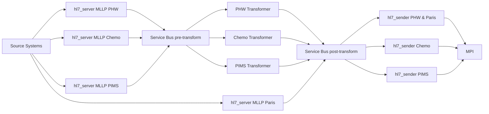
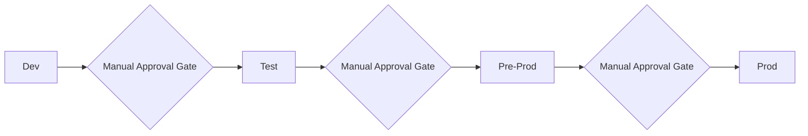

# Integration Hub overview – Training

|         |            |                                                                             |        |
| ------- | ---------- | --------------------------------------------------------------------------- | ------ |
| Version | Date       | Changes                                                                     | Author |
| 0.1     | 09/09/2025 | First draft completed                                                       | CI     |
| 0.2     | 11/09/2025 | Added heading numbering and a high level business flow diagram in section 6 | CI     |
| 0.3     | 12/09/2025 | New section on integration hub platform                                     | LJ     |
| 0.4     | 29/09/2025 | Update diagrams, streamline content and add panels for key info             | CI     |

Table of Contents

- [Why?](#why)
  - [Current Solution – Fiorano](#current-solution--fiorano)
  - [Strategic Alignment](#strategic-alignment)
- [What?](#what)
  - [Key features of the Integration Hub](#key-features-of-the-integration-hub)
  - [Benefits for DHCW and patients](#benefits-for-dhcw-and-patients)
- [How?](#how)
  - [What are Microservices?](#what-are-microservices)
    - [Traditional vs. Microservices Approach](#traditional-vs-microservices-approach)
    - [Why Use Microservices?](#why-use-microservices)
    - [Event-Driven Messaging: How Services Talk to Each Other](#event-driven-messaging-how-services-talk-to-each-other)
    - [Benefits of Event-Driven Messaging](#benefits-of-event-driven-messaging)
    - [Azure Service Bus: The Message Highway](#azure-service-bus-the-message-highway)
      - [Key Features](#key-features)
      - [Queues](#queues)
  - [Why Use Cloud Computing (Azure)?](#why-use-cloud-computing-azure)
    - [Benefits of Using Azure Cloud](#benefits-of-using-azure-cloud)
    - [Benefits for Healthcare](#benefits-for-healthcare)
- [Integration Hub Components](#integration-hub-components)
  - [HL7 Server Components - The Reception Desks](#hl7-server-components---the-reception-desks)
  - [Azure Service Bus](#azure-service-bus)
  - [Transformers](#transformers)
    - [hl7_transformer/ (PHW Transformer)](#hl7_transformer-phw-transformer)
    - [hl7_chemo_transformer/ (Chemocare Transformer)](#hl7_chemo_transformer-chemocare-transformer)
    - [hl7_pims_transformer/ (PIMS Transformer)](#hl7_pims_transformer-pims-transformer)
  - [Senders](#senders)
  - [Aside – Retry backoff strategy](#aside--retry-backoff-strategy)
  - [Shared Libraries](#shared-libraries)
    - [Health check library](#health-check-library)
      - [Why use TCP for health checks in Azure](#why-use-tcp-for-health-checks-in-azure)
    - [Message bus library](#message-bus-library)
    - [Event logger library](#event-logger-library)
      - [Why?](#why-1)
      - [Deep dive](#deep-dive)
      - [How logging works](#how-logging-works)
      - [Azure Monitor](#azure-monitor)
    - [Validation library](#validation-library)
      - [Structure](#structure)
        - [Schema resources](#schema-resources)
        - [Core validation functions](#core-validation-functions)
        - [Helper/utility functions](#helperutility-functions)
      - [Validation step by step](#validation-step-by-step)
      - [Usage in HL7 server](#usage-in-hl7-server)
      - [Why this approach](#why-this-approach)
- [Tech Stack](#tech-stack)
  - [UV and Python](#uv-and-python)
  - [Local development](#local-development)
    - [Benefits](#benefits)
    - [Docker](#docker)
    - [Docker compose structure](#docker-compose-structure)
    - [Secrets and security management, corporate networks](#secrets-and-security-management-corporate-networks)
    - [Dev workflow](#dev-workflow)
- [Integration Hub Platform](#integration-hub-platform)
  - [Azure Resources](#azure-resources)
    - [Applications in Azure Container Apps](#applications-in-azure-container-apps)
    - [Azure Service Bus](#azure-service-bus-1)
    - [Network Isolation and Security](#network-isolation-and-security)
  - [Infrastructure as Code (IaC) and Terraform](#infrastructure-as-code-iac-and-terraform)
  - [Environments](#environments)
  - [Deployment with Azure DevOps Pipelines](#deployment-with-azure-devops-pipelines)

# Why?

Quick summary: **Enables clinical data to flow securely and seamlessly between systems, empowering timely, data-driven decisions and improving patient outcomes.**

NHS Wales requires a modern solution to connect disparate digital health systems that use incompatible data formats and standards.

The Integration Hub is a cloud-native platform providing robust data validation and transformation capabilities to enable the seamless and secure exchange of sensitive clinical information. This new, internally-owned product replaces proprietary systems, unlocking agility, reducing costs, and ensuring data flows reliably between internal (NHS Wales) and third-party products to support patient care.

> [!NOTE]
> The Integration Hub replaces a proprietary, GUI‑centric platform with a fully code‑driven, cloud‑native approach—unlocking automation, scalability, and internal ownership while reducing licensing and private data centre dependency.

## Current Solution – Fiorano

- **Relies on a third-party vendor product and incurs the associated licence costs.**
- Is hosted in a **private data centre** and requires significant persistent infrastructure.
- Scaling is tied to hardware and licensing limitations.
- **Has a GUI based workflow, making automation and codified assurance difficult.**
- Requires specialist/propriety product-specific knowledge and skills to work with.
- Lacks the inherent scalability, resilience, and other features of modern Cloud.

## Strategic Alignment

Feeds into the DHCW Organisational Strategy 2024-2030 https://dhcw.nhs.wales/about-us/key-documents/strategies/organisational-strategy-2024-2030/

Achieves the following missions:

- Provide a platform for enabling digital transformation.
  The Integration Hub is the core engine for this.
- clean, open, and secure-by-design architecture.
- enables the decommissioning of legacy data centres by being cloud-native, and provides the essential mechanism for data to flow into the Welsh National Data Resource (NDR) where services are unable to integrate directly.

# What?

A solution that replaces the current complex, proprietary with **a modern, streamlined, code-first approach.**

**Using cloud-native services to ensure resilience and interoperability by design.**

It provides the scalable foundation needed to handle the growing volume of digital data across the health and care system.

## Key features of the Integration Hub

- provides **validation** of incoming and outgoing data against defined schemas and standards.
- **transforms** data between different formats and standards (e.g., HL7v2, FHIR).
- allows for **automated testing and deployment (CI/CD) pipelines.**
- robust **monitoring, logging, and alerting** for all integrations.
  - An observability dashboard is provided - a centralised view of system health, transaction volumes, error rates etc.
- Improved **handling of sensitive (patient-identifiable) clinical data**.

## Benefits for DHCW and patients

- Faster and more consistent development and deployment of new integrations, supported by comprehensive automation.
- Greater agility and flexibility in building and adapting integration solutions to meet evolving needs.
- Enhanced system reliability, resilience, and scalability through a modern, cloud-native architecture.
- Centralised visibility and easier troubleshooting of integration health via comprehensive observability dashboards.
- Cloud-native and future proof – more reliable, more modern, natively scalable with cloud infrastructure.
  - **Azure's pay-as-you-go model** is a significant benefit as it allows customers to pay only for the cloud resources you use, offering **flexibility** and **cost-effectiveness** by eliminating upfront commitments
  - enables customers to **scale resources up or down as needed**, which is especially beneficial for fluctuating workloads or when exploring cloud services.
- Reduced operational costs (e.g. license fees, private data centre overhead.) and longer-term cots lessening
- **Full ownership and control over code & architecture** of a critical piece of infrastructure.
- **Unlimited flexibility to build precisely what the business needs.**
- **Decreased time required to develop and deploy a new integration**, enabling faster delivery of business value.
- Enhanced business continuity and reduced risk of downtime.
- Natively scalable with cloud infrastructure. Pay-as-you-grow model.
- Enhanced Security through Secure-by-design approaches and security automation.
- A more efficient architecture, leading to reduced carbon footprint associated with the service.
- Improved patient outcomes and timely, data-driven decisions through reliable access to accurate clinical information.

# How?

The integration hub is built using a microservice architecture with event-driven messaging to connect multiple Welsh healthcare systems to a central Master Patient Index (MPI).

## What are Microservices?

### Traditional vs. Microservices Approach

Traditional monolithic architecture is like a single large building:

- All functionality is built as one large application
- Everything is connected and dependent on everything else
- If one part breaks, the whole system might go down
- Hard to update or change individual features

In comparison, in a **microservices architecture**:

- The system is broken down into many small, independent services
- Each service has a specific job (like authentication, data processing, notifications)
- Services can be developed, deployed, and updated independently
- If one service fails, others can continue working

> [!IMPORTANT]
> Microservices only deliver real value when each service is independently deployable, observable, and loosely coupled through asynchronous messaging — not when a monolith is sliced into tightly interdependent services sharing databases or synchronous chains.

### Why Use Microservices?

- Scalability
  - You can scale up just the parts that need more resources
- Flexibility
  - Different teams can work on different services simultaneously
- Resilience
  - If one service fails, others keep running

### Event-Driven Messaging: How Services Talk to Each Other

- Events are things that happen in the system (user logs in, data is updated, payment is processed)
- Messages are notifications sent when events occur
- Services listen for relevant events and respond accordingly

### Benefits of Event-Driven Messaging

1. Loose Coupling: Services don't need to know about each other directly
2. Real-time Processing: Events can trigger immediate responses
3. Reliability: Messages can be stored and retried if a service is temporarily down
4. Audit Trail: You have a record of everything that happened in the system

### Azure Service Bus: The Message Highway

Service Bus is used to decouple applications and services from each other.

#### Key Features

1. **Queues**: Messages wait in line until they're processed
2. **Topics and Subscriptions:** One message can be delivered to multiple interested services (like a newsletter)
3. **Reliability**: Messages are guaranteed to be delivered, even if services are temporarily offline
4. **Ordering**: Messages can be processed in the correct sequence when needed

#### Queues

Messages are sent to and received from queues. Queues store messages until the receiving application is available to receive and process them.

Messages in queues are ordered and timestamped on arrival. Once the broker accepts the message, the message is always held durably in triple-redundant storage.

Service Bus keeps messages in memory or volatile storage until the client reports them as accepted.

Messages are delivered in pull mode, only delivering messages when requested.

To retain message ordering all the queues are configured as FIFO queues.

> [!TIP]
> Queue FIFO settings help, but true end‑to‑end ordering also depends on transformers and senders avoiding parallel reordering (e.g. unordered async processing).

## Why Use Cloud Computing (Azure)?

Instead of buying and maintaining your own servers, cloud computing lets you rent computing power as needed (like using Uber).

### Benefits of Using Azure Cloud

1. Cost Effectiveness:

- Pay only for what you use
- No need to buy expensive hardware upfront
- Reduced maintenance costs

2. Scalability:

- Automatically handle more users during busy periods
- Scale down during quiet times to save money

3. Reliability:

- Microsoft maintains multiple data centres - redundancies
- Your system stays running even if one data centre has problems
- Automatic backups and disaster recovery

4. Security:

- Professional security teams monitor the infrastructure 24/7
- Regular security updates and patches
- Compliance with healthcare regulations

5. Global Reach:

- Access from anywhere in the world

### Benefits for Healthcare

Healthcare systems need to be:

- Reliable: Patient care depends on systems being available
- Secure: Patient data must be protected
- Compliant: Must meet strict healthcare regulations
- Interoperable: Must work with many different healthcare systems
- Scalable: Must handle varying loads

The microservices architecture with event-driven messaging on Azure cloud provides all these benefits while allowing the Integration Hub to evolve and improve over time without disrupting critical healthcare services.

# Integration Hub Components



Fig.1 A high level overview of how the components link together to form the 4 flows to date (24 Sept 2025)

## HL7 Server Components

These are the "front doors" that receive patient data from different healthcare systems.

Example:
A hospital in Cardiff sends patient admission data

1. The data arrives at, for example, the PHW HL7 server via TCP/MLLP protocol
2. The server receives the message and sends back an acknowledgment: "Got it!"
3. The server places the raw message onto the Azure Service Bus for further processing

The primary purpose of the HL7 server is to act as a reliable interface between external healthcare systems and our internal Azure-based integration platform. It ensures that:

- Only valid, well-formed HL7 messages enter our system
- Messages are properly acknowledged, so sending systems know whether delivery succeeded
- Valid messages are forwarded to appropriate Azure Service Bus queues for further processing

### The flow of a typical successful message through the server component

1. An external system sends an HL7 message (e.g., ADT^A31)
2. Our HL7 server receives the message through an Azure endpoint
3. The message is parsed and its control ID and type are extracted
4. Validation confirms the message structure and content meet our requirements
5. The message is forwarded to the appropriate Azure Service Bus queue
6. An acknowledgment (ACK) message with "AA" status is generated
7. The ACK is returned to the sending system
8. The sending system marks the transaction as complete
9. Downstream Azure services process the message from the Service Bus queue

If validation fails, the process changes at step 4, where:

4. An error is logged with specific details
5. The sending system receives information about why the message was rejected

## Azure Service Bus

Consists of multiple queues per service.

Example:

1. PHW sends patient data → HL7 Server → "phw-pre-transform" queue
2. PHW Transformer picks up message → processes it → "phw-post-transform" queue
3. HL7 Sender picks up the processed message from that queue → delivers it to MPI

## Transformers

These are the "specialists" that understand how to convert data from one hospital/healthcare provider format to a standard format everyone can understand. In our case that’s HL7v2.5.

### hl7_transformer/ (PHW Transformer):

- What it does
  - converts Public Health Wales messages to HL7 v2.5 standard
- Specific transformations
  - **Transforms datetime fields to match MPI requirements**
- Scenario
  - PHW sends a patient's birth date as "19850315" but MPI needs "1985-03-15T00:00:00Z"

### hl7_chemo_transformer/ (Chemocare Transformer):

- What it does
  - converts cancer treatment system data to HL7 v2.5 standard
- Specific transformations
  - Direct one to one mappings – a subset below, Chemocare source on the LHS, MPI target on the RHS.

| Chemocare source field | MPI Target field       |
| ---------------------- | ---------------------- |
| PID.5/XPN.10/DR.1/TS.1 | PID.5/XPN.10/DR.1/TS.1 |
| PID.5/XPN.10/DR.2/TS.1 | PID.5/XPN.10/DR.2/TS.1 |
| PID.5/XPN.11           | PID.5/XPN.11           |
| PID.6/XPN.1/FN.1       | PID.6/XPN.1/FN.1       |
| PID.7/TS.1             | PID.7/TS.1             |
| PID.8                  | PID.8                  |
| PID.9/XPN.1/FN.1       | PID.9/XPN.1/FN.1       |
| PID.10/CE.1            | PID.10/CE.1            |

- PID3 complex mapping

| Source Field | Value / Transformation                                                                                                                                                                                  | Target Field       |
| ------------ | ------------------------------------------------------------------------------------------------------------------------------------------------------------------------------------------------------- | ------------------ |
| PID.2/CX.1   | (copy source)                                                                                                                                                                                           | PID.3[1]/CX.1      |
|              | Constant: NHS                                                                                                                                                                                           | PID.3[1]/CX.4/HD.1 |
|              | Constant: NH                                                                                                                                                                                            | PID.3[1]/CX.5      |
| PID.2/CX.1   | Conditional prefix + PID.2.1:<br>If from VEL ('224') → `VCC` + PID.2.1<br>If from BCU ('212') → `BCUCC` + PID.2.1<br>If from SWW ('192') → `SWWCC` + PID.2.1<br>If from SEW ('245') → `SEWCC` + PID.2.1 | PID.3[2]/CX.1      |

### hl7_pims_transformer/ (PIMS Transformer):

- What it does
  - converts Patient Information Management System data to HL7 v2.5 standard
- Specific transformations
  - Direct one to one mappings - a subset below, PIMS source on the LHS, MPI target on the RHS.

|              |              |
| ------------ | ------------ |
| PIMS source  | MPI target   |
| MSH.10       | MSH.10       |
| MSH.11/PT.1  | MSH.11/PT.1  |
| MSH.12/VID.1 | MSH.12/VID.1 |
| MSH.13       | MSH.13       |
| EVN.1        | EVN.1        |

- Hardcoded mappings

|                 |             |
| --------------- | ----------- |
| Hardcoded value | MPI target  |
| GBR             | MSH.17      |
| EN              | MSH.19/CE.1 |
| ADT             | MSH.9/MSG.1 |
| 200             | MSH.5/HD.1  |
| 200             | MSH.6/HD.1  |

- More complex transformations

|                                                                                                                     |                    |
| ------------------------------------------------------------------------------------------------------------------- | ------------------ |
| Value                                                                                                               | MPI target         |
| If PIMS message is of type A04 -> set to A28, if A08 -> set to A31, otherwise -> set to A40                         | MSH.9/MSG.2        |
| If PIMS message is of type A04 or A08 -> set to ADT_A05, otherwise set to ADT_A39                                   | MSH.9/MSG.3        |
| If PIMS message PID.3[1]/CX.1 exists and is not empty AND PID.3[1]/CX.5 == 'NI' then use the value of PID.3[1]/CX.1 | PID.3[1]/CX.1      |
| If PIMS message PID.3[1]/CX.1 exists and is not empty AND PID.3[1]/CX.5 == 'NI' then set to "NHS"                   | PID.3[1]/CX.4/HD.1 |
| If PIMS message PD1.4 count > 1 and MSH.9/MSG.2 = 'A04' or MSH.9/MSG.2= 'A08' then PD1.4[2].XCN.1                   | PD1.3/XON.3        |

## Senders

The services responsible for delivering the transformed messages to their final destinations (MPI in our case)

We have specialised senders for some services – Chemocare and PIMS – for improved performance, load scalability and reliability.
PHW and Paris reuse the same endpoint and sender.

Features:

- Connection management - handles network issues
- Retry logic - keeps trying if MPI is temporarily down
- Delivery confirmation - ensures messages actually arrived
- Error handling - logs problems for investigation

How it works:

Sending transformed Chemocare patient data to MPI (more or less the same for other flows, bar transformation and the post-transform queue)

1. Sender Picks up processed message from post-transform queue
2. Establishes secure connection to MPI system
3. Sends the message using HL7 protocol
4. Waits for confirmation from MPI
5. If delivery fails, automatically retries with backoff strategy
6. Logs success/failure for audit purposes

## Aside – Retry backoff strategy

The first retry waits for the minimum delay.

On subsequent retries, time is added exponentially to the initial duration for each retry, until the maximum delay is reached.

Exponential back-off adds some small randomization to delays to stagger retries in high-throughput scenarios to avoid overwhelming the service.

Further example - in the [Message bus library](#message-bus-library)

## Shared Libraries

### Health check library

Provides a standardized way for all services to report their status - a piece of software that helps monitor whether your application is running correctly.

Example: Operations team can check if for example the Chemocare transformer is running properly.

For software we want to know:

- Is the application running?

- Can it connect to databases?

- Are all services responding?

- Is everything healthy?

This health check library serves several critical purposes:

1. Application Monitoring - Continuously verify that your application is running

2. Load Balancer Integration - Help load balancers know which servers are healthy

3. Container Orchestration - Allow systems like Docker/Kubernetes to restart unhealthy containers

4. Automated Alerting - Trigger notifications when something goes wrong

5. Debugging - Provide insights into what's working and what isn't

The health check library is a TCP-based health monitoring system designed specifically for Azure cloud environments - integrates seamlessly with Azure's cloud infrastructure and container orchestration platforms.

**Unlike HTTP-based health checks that return JSON responses, this library uses a much simpler approach - it opens a TCP socket and accepts connections.**

**When external monitoring systems can successfully connect to the socket, it means the application is healthy and running.**

#### Why use TCP for health checks in Azure

In Azure cloud environments, applications often run in containers or as microservices so we need **lightweight, fast health monitoring**. Thus we use a TCP-based approach, with the following benefits:

1. Azure Load Balancer Integration: Azure Load Balancer can perform TCP health probes by attempting to connect to a specific port

2. Container Orchestration: Azure Container Instances can use TCP checks as liveness and readiness probes

3. Application Gateway Health Probes: Azure Application Gateway can monitor backend health via TCP connections

4. Minimal Overhead: TCP connections require less processing than HTTP requests with JSON parsing. The health check doesn't need to exchange data - the successful TCP handshake itself is the health indicator. This makes it fast and lightweight.

5. Language Agnostic: External systems don't need to understand HTTP or JSON

Example:

If we have a Python application running in Azure Container Instances behind an Azure Load Balancer.

The load balancer needs to know which container instances are healthy so it can route traffic appropriately. Instead of making HTTP requests and parsing responses, the load balancer simply tries to establish a TCP connection to port 9000 on each container.

- If the connection succeeds, the container is healthy.
- If it fails or times out, the container is marked unhealthy and removed from the load balancing pool.

### Message bus library

The message bus library is a comprehensive Azure Service Bus wrapper designed specifically for healthcare data processing in Azure environments. It provides a simplified, standardized interface for sending and receiving messages while handling complex Azure Service Bus operations, error recovery, audit logging, and compliance tracking automatically.

The library is built around the concept of reliable message processing with full audit trails.

We can create different types of Azure Service Bus clients using the factory design pattern which handles:

- Authentication Decision: Automatically chooses between connection string and managed identity
  - Connection string - Uses shared access keys, simpler for development environments
  - Managed identity - Uses Azure AD authentication, more secure for production environments, no secrets in configuration, automatic credential rotation
- Client Creation: Creates the underlying Azure Service Bus client
- Resource Management: Ensures proper client lifecycle management

We support 2 types of sender clients:

- Queues - Point-to-point messaging (one sender, one receiver)
- Topics - Publish-subscribe messaging (one sender, multiple subscribers)

The sender clients implement error handling for different Azure Service Bus failure scenarios – network timeouts, oversized messages, service issues

The type of message receiver client supported implements a feature called PEEK LOCK, crucial for reliable message processing.

- Message is "peeked" from the queue and locked (invisible to other consumers)
- Consumer processes the message
- if successful, message is completed and deleted
- if failed, message lock expires and becomes available for retry
- prevents message loss and duplicate processing

The message receiver client implements exponential backoff to handle processing failures gracefully.

Benefits:

- Reduces load on failing downstream services
- Gives time for transient issues to resolve
- Prevents problems when multiple instances retry simultaneously
- Common pattern in distributed systems

First failure: Wait 5 seconds before retry

Second failure: Wait 10 seconds (5 \* 2)

Third failure: Wait 20 seconds (10 \* 2)

Maximum delay: Caps at 15 minutes to prevent excessive delays

### Event logger library

The event logger library is a shared component that standardises how different microservices in the Integration Hub log important events and activities.

Essentially, a specialized logging system that not only records what happens in your application locally but can also send that information to Azure's cloud monitoring service called Azure Monitor Application Insights.

#### Why?

In a distributed system with multiple microservices handling healthcare messages, we need to track what happens to each message as it flows through the system. Without proper logging, when something goes wrong, it becomes very difficult to trace where the problem occurred. This library solves several key problems:

1. Centralized Monitoring - All microservices use the same logging format and send data to the same Azure monitoring system

2. Structured Data - Instead of just plain text logs, it creates structured data that can be easily searched and analysed

3. Fallback Capability - If Azure monitoring isn't available, it still logs locally so you don't lose information

4. Standardization - All services log events in exactly the same way, making troubleshooting consistent

**Having this structured logging system provides several operational benefits:**

1. End-to-End Traceability: You can follow a single message through the entire system using the workflow_id

2. Service-Specific Views: You can see all activity from a specific microservice using the microservice_id

3. Failure Analysis: When messages fail, you have detailed error information and context

4. Performance Monitoring: You can track how long messages take to process and identify bottlenecks

By integrating with Azure Monitor, the library enables:

1. Centralized Dashboard: All logs from all microservices appear in a single Azure portal dashboard

2. Advanced Querying: You can write complex queries to analyse patterns across your entire system

3. Alerting: Azure can automatically alert you when certain error patterns occur

4. Long-term Storage: Logs are automatically archived and can be retained

5. Integration with Other Azure Services: The logging data can trigger automated responses or integrate with other monitoring tools

#### Deep dive

**LogEvent class** - a data structure that defines what information gets recorded for each event. Every log event contains:

- workflow_id: Identifies which business process this event belongs to

- microservice_id: Identifies which specific service generated this event

- event_type: What kind of event this is (like MESSAGE_RECEIVED or MESSAGE_FAILED)

- timestamp: Exactly when this event occurred

- message_content: The actual message or data being processed

- validation_result: Information about whether the message passed validation checks

- error_details: If something went wrong, detailed information about what happened

The EventType enumeration defines six specific types of events that can be logged:

- MESSAGE_RECEIVED: When a message first arrives

- MESSAGE_PROCESSED: When a message has been successfully handled

- MESSAGE_SENT: When a message is forwarded to another system

- MESSAGE_FAILED: When something goes wrong processing a message

- VALIDATION_SUCCESS: When a message passes validation checks

- VALIDATION_FAILED: When a message fails validation

**EventLogger** - This is the main component that microservices use to actually log events. Must provide the following on initialisation:

1. workflow_id that identifies the business process

2. microservice_id that identifies which service is doing the logging

When an EventLogger is created, it goes through this process:

1. Check Configuration: It looks for an environment variable called APPLICATIONINSIGHTS_CONNECTION_STRING

**2. Decision: If this connection string exists, it enables Azure Monitor logging. If not, it falls back to standard Python logging**

3. Initialize Azure Monitor (if enabled): It sets up the connection to Azure's monitoring service using authentication credentials

#### How logging works

When you call one of the logging methods (like log_message_received), here's what happens:

1. Create Event Object - The method creates a LogEvent object with all the relevant information

2. Convert to Dictionary - The event is converted to a Python dictionary format

3. Add Metadata - Extra fields like the string representation of the event type and formatted timestamp are added

4. Send to Destination -Depending on configuration, the event is either sent to Azure Monitor or logged locally

#### Azure Monitor

When Azure Monitor is enabled, the library uses Azure's OpenTelemetry integration. OpenTelemetry is a standard framework for collecting telemetry data (logs, metrics, traces) from applications. The library:

1. Uses the azure-monitor-opentelemetry package to configure the connection

2. Passes the structured event data as "extra" information to the standard Python logger

3. Azure Monitor automatically receives this data and makes it available for querying and analysis in the Azure portal

**Fallback Logging**

When Azure Monitor is not available or not configured, the library falls back to using Python's standard logging module. In this mode, it formats all the event information into a readable log message that gets written to the application's log output.

Example:

In hl7_server

- The HL7ServerApplication creates an EventLogger during startup
- This EventLogger is then passed to the message handlers that process incoming HL7 messages.
- The GenericHandler uses the event logger throughout the message processing lifecycle:
  - When a message arrives: It calls log_message_received to record that a new message has been received
  - After validation: It calls log_validation_result to record whether the message passed validation checks
  - On success: It calls log_message_processed when the message is successfully handled
  - On failure: It calls log_message_failed when something goes wrong, including detailed error information
- This creates a complete audit trail of what happens to each message as it flows through the system.

### Validation library

a comprehensive system designed to validate HL7 messages against predefined XML schemas to ensure they conform to expected standards and structures.

Analogy - having a universal language for healthcare computers to talk to each other. Just as we need proper grammar and structure when writing a letter, HL7 messages need proper structure so receiving systems can correctly interpret patient data.

The validation library serves as a quality control system that checks incoming HL7 messages to ensure they meet the required standards before processing them. This prevents several critical problems:

1. Data Corruption - malformed messages could cause systems to misinterpret patient data
2. System Crashes - invalid data structures might cause receiving systems to fail
3. Compliance Issues - healthcare systems must meet regulatory requirements for data handling
4. Integration Failures - different healthcare systems need consistent data formats to communicate

Key benefits:

1. Data Quality Assurance

By validating every message against strict schemas, the system ensures that only properly formatted, complete healthcare data enters the system. This prevents scenarios where incomplete patient records could lead to medical errors.

2. System Interoperability and regulatory compliance

Different healthcare systems (hospitals, labs, pharmacies) can trust that messages they receive will be in the expected format adhering to the HL7 standard, making integration between systems much more reliable.

3. Error Prevention

Catching validation errors early prevents them from propagating through the healthcare system where they could cause more serious problems downstream.

4. Audit trail

The integration with the event logger creates a complete audit trail of message validation, which is crucial for healthcare compliance and troubleshooting.

#### Structure

3 key components – see subheadings underneath.

##### Schema resources

The library contains XML Schema Definition (XSD) files that define the exact structure and rules for different types of HL7 messages. These schemas are organized by "flow" which represents different healthcare organizations or systems – PIMS, Chemocare, PHW, Paris.

Each flow has the following types of schema files, for instance for Paris:

- **Fields Schema (2_5_1_fields.xsd) -** Defines individual data elements like patient names, dates, identifiers. Act as a vocabulary - what each piece of data should look like.
- **Types Schema (2_5_1_types.xsd)** - Defines complex data types that combine multiple fields. For example, a patient name might combine first name, last name, and title into one complex type.
- **Segments Schema (2_5_1_segments.xsd)** - Defines larger blocks of related information like patient demographics (PID segment) or message header information (MSH segment).
- **Message Structure Schemas (ADT_A05.xsd, ADT_A39.xsd)** - Define complete message types like admission notifications or patient merge messages. These specify which segments are required, optional, and in what order they should appear.

##### Core validation functions

`validate.py` - the main entry point that orchestrates the entire validation process. When you want to validate a message, you call functions in this file.

`convert.py` - converts HL7's native ER7 format (pipe and hat delimited text) into XML format so it can be validated against XML schemas. This is like translating from one language to another while preserving all the meaning.

`schemas.py` - manages access to all the different schema files and helps determine which schema should be used for which message type.

##### Helper/utility functions

The utils folder contains helper functions that handle specific tasks, such as:

- analysing the message structures to understand the organization and hierarchy of different message components.
- creating mappings between different schema elements to understand relationships and inheritance between data types.
- extracting key information from messages like message type, trigger events, and structure identifiers.

#### Validation step by step

**Step 1: Message Analysis**

First, the system examines the incoming message to determine:

- What type of message it is (like an admission, discharge, or transfer)
- What trigger event occurred (like A28 for adding person information)
- What message structure should be used for validation

This information is typically found in the `MSH` (Message Header) segment of the HL7 message.

For example, a message might be identified as `"ADT^A28^ADT_A05"` meaning it's an ADT (Admission, Discharge, Transfer) message with **trigger event A28** using the **ADT_A05** structure.

**Step 2: Schema Selection**

Based on the message analysis and the specified flow, for example Paris, the system selects the appropriate XSD schema file. For example, if validating a Paris flow ADT_A05 message, it would use the file at resources/paris/ADT_A05.xsd.

Step 3: ER7 to XML Conversion

HL7 messages typically arrive in ER7 format, which looks like this:

```
MSH|^~\&|SENDING_APP|SENDING_FACILITY|RECEIVING_APP|RECEIVING_FACILITY|20230901120000||ADT^A28^ADT_A05|MSG001|P|2.5.1
EVN||20230901120000
PID|1||123456789^^^MRN||DOE^JOHN^M||19800101|M|||123 MAIN ST^^ANYTOWN^ST^12345
```

The convert.py module transforms this into structured XML that looks like:

```xml
<ADT_A05 xmlns="urn:hl7-org:v2xml">

<MSH>
<MSH.1>|</MSH.1>
<MSH.2>^~\&</MSH.2>
<MSH.3>
<HD.1>SENDING_APP</HD.1>
</MSH.3>
<!-- ... more fields -->
</MSH>

<EVN>
<EVN.2>
<TS.1>20230901120000</TS.1>
</EVN.2>
</EVN>

<PID>
<!-- patient information fields -->
</PID>
</ADT_A05>
```

This conversion process is fairly complex because it must:

- Parse the pipe-delimited format correctly
- Handle repeated fields and components
- Create proper XML hierarchy
- Insert required but missing segments (e.g. EVN if required)
- Map field positions to XML element names
- Handle different data types appropriately

**Step 4: XML Schema Validation**

Once the message is in XML format, the system uses the Python xmlschema library to validate it against the selected XSD file. This validation checks:

- Structure - Are all required segments present? Are they in the correct order?
- Data Types - Do dates look like dates? Do numbers contain only numeric characters?
- Cardinality - Are there the right number of repetitions for repeating fields?
- Value Sets - Do coded values match allowed values?
- Dependencies - Are conditional fields present when required?

**Step 5: Error Reporting**

If validation fails, the system provides detailed error messages explaining exactly what went wrong, such as:

- `"Required segment PV1 is missing"`
- `"Field PID.7 (Date of Birth) contains invalid date format"`
- `"Invalid segment XYZ"`

#### Usage in HL7 server

Here’s how the validation library integrates into a real healthcare message processing system:

When the HL7 server receives a message, it first logs that a message was received using the event logger.
The system uses the hl7apy library to do basic parsing and extract key information like message type and control ID.
The system performs standard HL7 validation using the HL7Validator class to check basic message structure.
If a flow name is specified (like "paris"), the system calls the validation library.

If validation fails, the system:

- Logs detailed error information
- Records the validation failure in the event logger
- Raises an exception to stop processing the invalid message

If validation succeeds:

- The message is sent to the service bus for further processing
- An ACK (acknowledgment) message is generated
- Success is logged in the event logger

#### Why this approach

The decision to use XSD schema validation for HL7 message validation was primarily driven by the fact that comprehensive XML Schema Definition files were already available from healthcare standards organisations and could be directly utilised without manual recreation.

Python's robust ecosystem of XML processing libraries, particularly xmlschema and defusedxml, provided mature, well-tested tools for parsing and validating against these schemas with minimal implementation effort.

The resulting solution is inherently self-documenting, version-controlled through schema updates, and provides precise, standardized error messages that directly reference official HL7 specification terminology, making it immediately familiar to healthcare IT professionals who already understand XSD-based validation approaches.

> [!NOTE]
> Using the existing HL7 XSD schemas avoids re‑implementing hundreds of structural rules in code. The schemas double as authoritative documentation and validation logic, accelerating adaptation to HL7 updates, reducing maintenance, and allowing for precise error feedback.

# Tech Stack

- Hosting: Azure Cloud
- Code development: Python 3.13
- dependency management: PIP (planned migration to [UV](https://github.com/astral-sh/uv) )
- infrastructure: Terraform
- testing tools
  - functional testing: Python 3.13, Framework: **pytest**
  - performance testing: **TBD**
  - HAPI test panel
- code quality tools
  - [Bandit](https://github.com/PyCQA/bandit)  - security scanner
  - [Ruff](https://github.com/astral-sh/ruff)  - linter and code formatter (as pre-commmit hook: <https://github.com/astral-sh/ruff-pre-commit> )
  - [MyPy](https://github.com/python/mypy)  - static type checker (pre-commit hook: <https://github.com/pre-commit/mirrors-mypy> )
  - [detect-secrets](https://github.com/Yelp/detect-secrets)  - secrets detection

**Development tooling**

- Preferred Integrated Development Environment: Visual Studio Code
- Docker Desktop - for local development and testing

**Code repositories**

- Microservices - <https://github.com/DHCW-Digital-Health-and-Care-Wales/Integration-Hub-Beta>
- Terraform - <https://github.com/DHCW-Digital-Health-and-Care-Wales/Integration-Hub-Terraform>
- Automated tests - <https://github.com/DHCW-Digital-Health-and-Care-Wales/Integration-Hub-tests>

## UV and Python

We’re using UV as the standard tool for python requirements/package management.

- offers savings in computing and development time
- handles python virtual environment creation

**Through the lockfile uv ensures a consistent, easily reproducible project setup across different systems**

It’s easy to migrate to with existing tooling before fully switching over a project (which we already did)
UV also offers compatible and familiar api commands – pip install -> uv pip install

## Local development

The **local** folder in the Integration Hub Beta project serves as a comprehensive development environment setup that allows developers to run the entire healthcare integration system on their local machines using containerization technology.

### Benefits

The primary purpose of the local setup is to create a complete, isolated replica of the production Integration Hub system that developers can run on their personal computers. Benefits of this include:

- Development and Testing - Developers can write code, test new features, and debug issues without affecting production systems or requiring internet connectivity to cloud services.
- Cost Efficiency - Instead of provisioning expensive Azure resources for every developer, the local environment uses free, open-source alternatives that provide the same functionality.
- Speed and Reliability - Local development eliminates network latency and dependency on external services, making development cycles faster and more reliable.
- Isolation - Each developer has their own complete environment, preventing conflicts when multiple people are working on different features simultaneously.

The local environment is designed to behave as similarly as possible to production:

- Same HL7 Message Formats and validation rules
- Same Communication Patterns (services communicate through message queues exactly like in production)
- Same Configuration Model - uses the same environment variable and configuration file approaches

This ensures that code tested locally will behave predictably when deployed to production.

### Docker

The local environment is built using Docker, which is a containerization platform that packages applications and their dependencies into lightweight, portable containers.

Docker Compose is used to orchestrate multiple containers that work together as a complete system. It defines how different services should be started, how they should communicate with each other, and what resources they need.

**One of the most critical components is the Azure Service Bus emulator.** In production, the Integration Hub uses Azure Service Bus, which is Microsoft's cloud messaging service that enables reliable communication between different services. The emulator provides the exact same functionality but runs locally on your computer instead of in the cloud.

Service bus configuration - `ServiceBusEmulatorConfig.json` defines the message routing infrastructure:

**Queues**: Named channels where messages wait to be processed. For example, there might be a "chemo-incoming" queue where chemotherapy messages wait for processing.

**Topics and Subscriptions**: More sophisticated message routing where messages can be delivered to multiple interested services. A topic might represent "patient-updates" with different subscriptions for different systems that need to know about patient changes.

This configuration mirrors exactly how the production Azure Service Bus is set up.

### Docker compose structure

The docker-compose setup supports multiple "profiles" which represent different healthcare organizations or integration scenarios:

phw-to-mpi - Public Health Wales integration

paris-to-mpi - Paris healthcare system integration

etc.

Each profile represents a complete data flow from a specific healthcare organization to the Master Patient Index (MPI).

This modular approach allows developers to work on specific integration scenarios without running the entire system, saving computer resources and reducing complexity.

There are also numerous .env files that configure each service:

**chemo-hl7-server.env:** Configures the HL7 server that receives Chemo-related messages. This includes settings like:

- which port to listen on,
- what message validation rules to apply,
- where to forward processed messages.

**mpi-hl7-sender.env**: Configures the service that forwards transformed messages to MPI.

**mpi-hl7-mock-receiver.env**: Configures a mock version of MPI that simulates **receiving messages** without requiring the actual MPI system.

These environment files separate configuration from code, allowing the same service code to behave differently in different environments (local development, testing, production) just by changing configuration values.

### Secrets and security management, corporate networks

The **.secrets-template** and **generate_secrets.py** files handle sensitive information like passwords and connection strings. **generate_secrets.py** creates unique, secure credentials for the local environment, ensuring that:

- Each developer has unique credentials
- No real production credentials are stored in the code repository
- The local environment is secure even though it's for development

The setup also includes specific provisions for corporate development environments:

- Proxy Configuration: Handles corporate firewall and proxy requirements that often block standard Docker operations
- Certificate Management: Supports custom SSL certificates required by corporate security policies
- Network Isolation: Can operate in restricted network environments

### Dev workflow

Developers start specific integration scenarios using Docker Compose profiles:

**docker compose --profile chemo-to-mpi up -d**

This command starts only the services needed for the chemotherapy integration workflow: the chemo HL7 server, chemo transformer, Service Bus emulator, and mock MPI receiver.

The "-d" flag runs services in the background so developers can continue working.

> [!NOTE]
> For more information about runing the services locally including running the HAPI TestPanel, follow the steps in the [README in `local/` ](https://github.com/DHCW-Digital-Health-and-Care-Wales/Integration-Hub-Beta/tree/main/local)

# Integration Hub Platform

The **Platform** is the backbone of the Integration Hub. It provides the infrastructure, security, and automation that allow the Integration Hub to run reliably, securely, and at scale. This section explains the **what**, **why**, and **how** of the platform in detail.

## Azure Resources

The Integration Hub is hosted in **Microsoft Azure**, within the **NHS Wales DHCW subscription** named:

**NHSWales-DHCW-IntegrationHub-Subscription**

All resources are grouped into **Azure Resource Groups**, which act like folders to organize related services. This makes it easier to:

- Apply security policies
- Monitor costs
- Manage permissions

### Applications in Azure Container Apps

Applications are deployed as **container apps** in the **Azure Container Apps** environment.

**What is a container app?**
Like a shipping container, container app holds everything needed for its contents to work anywhere. Similarly, a container app includes:

- The application code
- All its dependencies (libraries, runtime, etc.)

This ensures the app runs the same way everywhere, on a developer’s laptop, in testing, or in production.

**Benefits of container apps:**

- **Consistency:** No “it works on my machine” issues.
- **Scalability:** Automatically scale up during high demand and scale down when idle.
- **Isolation:** Each app runs in its own container, reducing risk of conflicts.
- **Cost efficiency:** Pay only for what you use.
- **Resilience:** If one container fails, others keep running.

### Azure Service Bus

The platform uses **Azure Service Bus** for **messaging** between services.

It acts as a **postal system for applications**:

- Services send messages to queues or topics.
- Other services pick them up when ready.
- This decouples services, making the system more resilient and easier to maintain.

**Why is this important?**
If one service is down, messages wait in the queue until it’s back online. This prevents data loss and ensures reliability.

### Network Isolation and Security

The entire solution runs inside an **isolated virtual network (VNet)**:

- **No public internet exposure** – services cannot be accessed from the internet.
- **Private Endpoints** – secure connections between services over the Azure backbone network.
- **RBAC (Role-Based Access Control)** – permissions are tightly controlled so only authorized users and services can access resources.

**Why does this matter?**
Healthcare data is highly sensitive. These measures ensure compliance with strict security and privacy regulations.

## Infrastructure as Code (IaC) and Terraform

**What is IaC?**
Instead of manually creating resources in the Azure portal, we write **code** that describes the desired infrastructure. Terraform then:

- Reads the code
- Creates or updates resources to match the desired state

**Benefits of IaC:**

- **Consistency:** Every environment is built the same way.
- **Version control:** Infrastructure changes are tracked in Git, just like application code.
- **Automation:** No manual clicks—reduces human error.
- **Repeatability:** Quickly recreate environments if needed.
- **Auditability:** Every change is documented and reviewable.

**Why Terraform?**
Terraform is cloud-agnostic, widely used, and integrates well with Azure. It allows us to manage complex environments with reusable modules and automated workflows.

## Environments

The Integration Hub uses **multiple environments** to ensure safe and reliable deployments:

- **Development (dev):** For building and experimenting with new features.
- **Testing (test):** For validating functionality and running automated tests.
- **Pre-Production (pre-prod):** A near-identical copy of production for final checks.
- **Production (prod):** The live environment serving real users.



**Why multiple environments?**

- **Risk reduction:** Bugs are caught before production.
- **Quality assurance:** Features are tested in stages.
- **Compliance:** Healthcare systems require strict validation before going live.
- **Controlled rollout:** Changes move through a pipeline, reducing the chance of failure.

## Deployment with Azure DevOps Pipelines

Deployments are automated using **Azure DevOps (ADO) pipelines**.

**YAML Pipelines**

- **Infrastructure deployments:** YAML pipelines provision Azure resources using Terraform.
- **Application deployments:** Build and release pipelines package and deploy application code.

The detailed instruction on application deployment process is available in this ADO Wiki:

<https://dev.azure.com/NHS-Wales-Digital/INSE/_wiki/wikis/INSE.wiki/4753/Container-App-Build-Deployment-Guide>

**Why use pipelines?**

- **Automation:** Reduces manual steps and errors.
- **Traceability:** Every deployment is logged and auditable.
- **Consistency:** Same process for every environment.
- **Controlled releases:** Only tested and approved changes reach production.

**Pipeline process:**

1. Developer commits code to Git.
2. Pipeline runs automated tests.
3. If tests pass, pipeline deploys to dev → test → pre-prod → prod.
4. Each stage requires approval before moving forward.

**Benefits:**

- Faster, safer releases
- Reduced downtime
- Full visibility of deployment history
