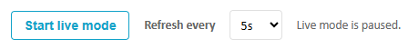
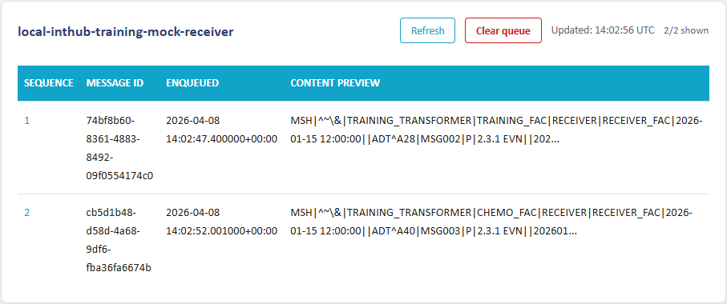
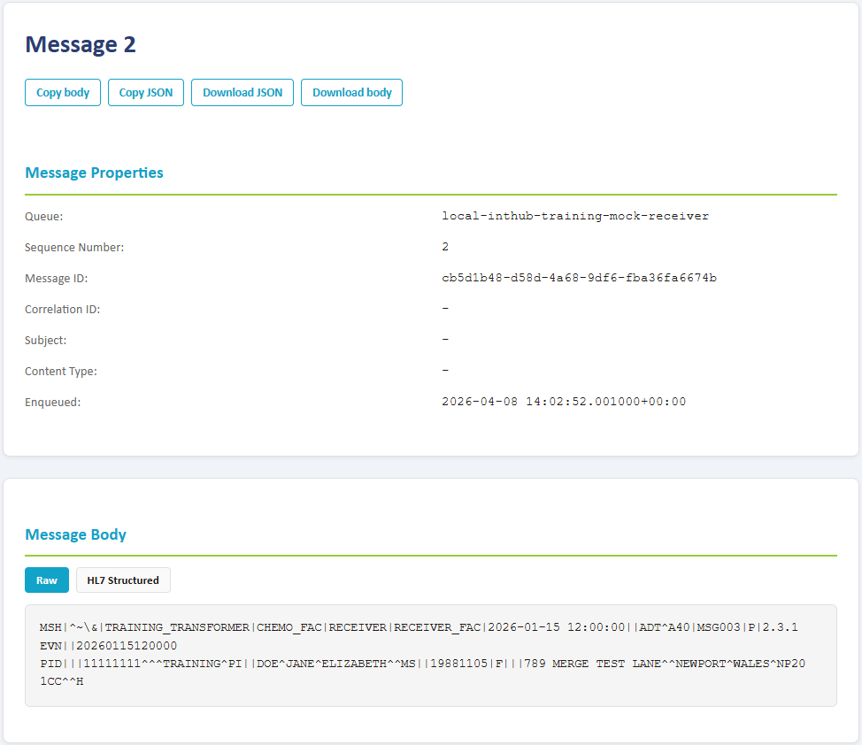

# BusWatch

BusWatch is a small Python web app that peeks Azure Service Bus queue messages and shows message details in a browser.

## Features

- Lists queues from local ServiceBusEmulatorConfig.json (or from configured queue names)
- Shows queue runtime metrics (active, dead-letter, scheduled)
- Peeks messages without dequeueing
- Clears all currently available messages from an individual queue
- Handles session-enabled queues using next available session
- Clickable message sequence numbers to open full message detail
- Message detail supports HL7 structured parsing with per-segment/per-field view (with raw toggle)
- Optional live mode auto-refresh (pause/resume, interval control, and new-row highlight)

## Environment Variables

- `SERVICEBUS_CONNECTION_STRING`: Service Bus connection string. Defaults to emulator-friendly value.
- `BUSWATCH_QUEUE_NAMES`: Optional comma-separated queue names. If omitted, BusWatch loads queue names from `local/ServiceBusEmulatorConfig.json`.
- `BUSWATCH_PEEK_COUNT`: Number of messages to show per queue on the home page. Default: `25`.
- `BUSWATCH_DETAIL_SEARCH_LIMIT`: Max peek depth when searching for a specific sequence number. Default: `250`.

## Run

```bash
cd buswatch
uv sync
uv run uvicorn buswatch.main:app --reload --host 127.0.0.1 --port 8080
```

Then open `http://localhost:8080`.

## Test

```bash
cd buswatch
uv run python -m unittest discover tests
```

## Usage

The UI will display queues that have been configured in the `buswatch.env` file:
```
# Optional comma-separated queue names.
# Leave empty to use queue discovery from ServiceBusEmulatorConfig.json.
BUSWATCH_QUEUE_NAMES=local-inthub-training-transformer-ingress,local-inthub-training-egress,local-inthub-training-mock-receiver
```
To discover all queues automatically from `ServiceBusEmulatorConfig.json`, leave this option blank:

`BUSWATCH_QUEUE_NAMES=`

Individual queues can be refreshed by pressing the refresh button on the queue card.

To refresh all the queues press the **Refresh All Queues** button at the top of the page.

Queues can also be periodically refreshed automatically using **Live mode**



This allows autorefreshing of the queues every 2, 5, 10 or 30 seconds.

Messages in queues are displayed as below:


To see the message detail click the sequence number link, e.g. clicking the sequence number **2**: 


From this screen the message can be copied or downloaded in either raw or json format.

#### Example
Raw format
```
MSH|^~\&|TRAINING_TRANSFORMER|CHEMO_FAC|RECEIVER|RECEIVER_FAC|2026-01-15 12:00:00||ADT^A40|MSG003|P|2.3.1
EVN||20260115120000
PID|||11111111^^^TRAINING^PI||DOE^JANE^ELIZABETH^^MS||19881105|F|||789 MERGE TEST LANE^^NEWPORT^WALES^NP20 1CC^^H
```
JSON
```
{
  "queue_name": "local-inthub-training-mock-receiver",
  "sequence_number": "2",
  "message_id": "cb5d1b48-d58d-4a68-9df6-fba36fa6674b",
  "correlation_id": null,
  "subject": null,
  "content_type": null,
  "enqueued_time_utc": "2026-04-08 14:02:52.001000+00:00",
  "body": "MSH|^~\\&|TRAINING_TRANSFORMER|CHEMO_FAC|RECEIVER|RECEIVER_FAC|2026-01-15 12:00:00||ADT^A40|MSG003|P|2.3.1\nEVN||20260115120000\nPID|||11111111^^^TRAINING^PI||DOE^JANE^ELIZABETH^^MS||19881105|F|||789 MERGE TEST LANE^^NEWPORT^WALES^NP20 1CC^^H",
  "application_properties": {}
}
```
To return to the Queue page click the **Back to queues** link at the top of the page.

To clear messages from a particular queue, click the **Clear queue** button.
## Notes

- Message reads use `peek`, so no locks are taken and no messages are removed.
- This project is emulator-first: queue names are read from `local/ServiceBusEmulatorConfig.json` by default.
- Queue runtime counters are not queried from the management API in emulator mode, so those values show as unavailable.
- If the app cannot list queues automatically, set `BUSWATCH_QUEUE_NAMES` explicitly.
- For Docker runs, use `Endpoint=sb://sb-emulator` in `SERVICEBUS_CONNECTION_STRING`.
- Session-enabled queue refreshes are tuned for responsiveness on list pages (short wait, no SDK retries), while detail lookups use a slightly longer wait for stability.

## Troubleshooting

### 1) Connection refused while peeking queues

Error example:

`Message peek failed: Failed to initiate the connection due to exception: [Errno 111] Connection refused`

Common cause:

- BusWatch is running in Docker but `SERVICEBUS_CONNECTION_STRING` uses `Endpoint=sb://localhost`.

Fix:

- In Docker, set `SERVICEBUS_CONNECTION_STRING` to use `Endpoint=sb://sb-emulator`.
- Restart/recreate the BusWatch container after changing env values.

### 2) Session-required queue opened as non-session queue

Error example:

`It is not possible for an entity that requires sessions to create a non-sessionful message receiver`

Common cause:

- BusWatch cannot read queue metadata from `ServiceBusEmulatorConfig.json`, so it cannot detect `RequiresSession=true` queues.

Fix:

- Ensure `ServiceBusEmulatorConfig.json` is mounted into the BusWatch container (for this project: `/app/ServiceBusEmulatorConfig.json`).
- Recreate BusWatch after updating Docker Compose.

### 3) Empty session queue refresh feels slow

Symptoms:

- Refreshing an empty session-enabled queue takes much longer than expected.

Cause:

- Session acquisition (`NEXT_AVAILABLE_SESSION`) can wait while probing for an active session.

Current behavior:

- List refresh uses a short session wait and disabled SDK retries for faster UI response.
- Detail lookup uses a slightly longer session wait to improve reliability.
