# Working with Alarms

**Integration Hub NOC Dashboard — Operator Guide**

| | |
|---|---|
| **Audience** | Application Operations Engineers, Integration Hub support staff |
| **Applies to** | Integration Hub Dashboard — *Alarms* section |
| **Covers** | Adding, editing, removing, pausing and scheduling pauses for alarms |

---

## Contents

1. [Introduction](#1-introduction)
2. [Alarm types at a glance](#2-alarm-types-at-a-glance)
3. [Navigating the Alarms section](#3-navigating-the-alarms-section)
4. [Adding an alarm](#4-adding-an-alarm)
5. [Editing an alarm](#5-editing-an-alarm)
6. [Removing an alarm](#6-removing-an-alarm)
7. [Pausing alarms](#7-pausing-alarms)
8. [Scheduling a pause](#8-scheduling-a-pause)
9. [Managing pauses](#9-managing-pauses)
10. [Where pause status is shown](#10-where-pause-status-is-shown)
11. [Quick reference](#11-quick-reference)
12. [Troubleshooting](#12-troubleshooting)

---

## 1. Introduction

The Integration Hub Dashboard monitors each integration flow (for example *PHW → MPI*) using
**alarm rules**. Each rule belongs to one flow, which is identified by its **workflow ID**
(for example `phw-to-mpi`). When a rule's condition is met, the alarm fires and, if configured,
sends an email alert.

This guide explains how to:

- **Add** new alarm rules to a flow.
- **Edit** or **remove** existing rules.
- **Pause** alarms immediately, for example during an unplanned incident.
- **Schedule** pauses in advance, for example for planned maintenance or deployments.

> **Note:** Alarm configuration and pause records are stored centrally. Changes you make
> apply to every dashboard user straight away.

---

## 2. Alarm types at a glance

There are three alarm types. You can configure any combination of them for each flow.

| Alarm | Name | Fires when… | Varies by time of day? |
|---|---|---|---|
| **Alarm 1** | Inactivity | The flow has **received** no messages for longer than the threshold. | Yes (Day / Evening / Weekend) |
| **Alarm 2** | Outgoing Message Volume | The flow has **sent** no messages for longer than the threshold. | Yes (Day / Evening / Weekend) |
| **Alarm 3** | Message Processing Failures | The number of `MESSAGE_FAILED` events within the lookback window reaches the threshold. | No |

Alarms 1 and 2 use different thresholds depending on the period:

| Period | When it applies |
|---|---|
| **Day** | Monday to Friday, 09:00–17:00 |
| **Evening** | Monday to Friday, 17:00–09:00 |
| **Weekend** | Friday 17:00 to Monday 09:00 |

Every rule also has an **Alerting Gap**. After a rule fires, it will not fire again for this
many minutes. During this time its status shows as **Suppressed**. When the condition clears,
the gap resets, so the next problem alerts straight away.

---

## 3. Navigating the Alarms section

Select **Alarms** in the top navigation bar to open the **Alarms Summary** page.

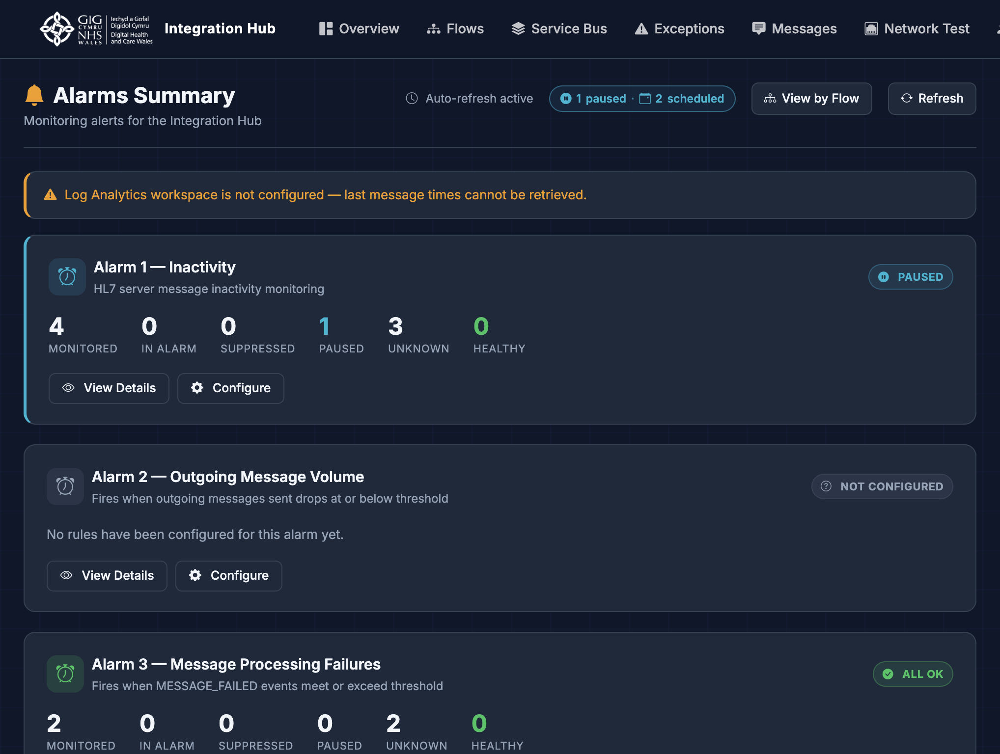

*Figure 1 — Alarms Summary page*

From this page you can:

| Control | Purpose |
|---|---|
| **Pause indicator** (`N paused · M scheduled`) | Opens the **Alarm Pauses** page. |
| **View by Flow** | Shows all three alarm types for one flow on a single page. |
| **Refresh** | Re-evaluates alarm status straight away. |
| **View Details** (on each alarm card) | Opens the status page for that alarm type. |
| **Configure** (on each alarm card) | Opens the **Alarm Configuration** page. |

Each alarm card shows how many rules are *Monitored*, *In Alarm*, *Suppressed*, *Paused*,
*Unknown* and *Healthy*.

> **Note:** A status of **Unknown** means the dashboard could not find recent message
> data for the flow. You will see this in demo or local environments where Log Analytics is
> not configured.

---

## 4. Adding an alarm

Alarm rules are configured **per flow**. A single configuration page shows every Alarm 1, 2
and 3 rule for the selected flow.

### 4.1 Open the configuration page for a flow

1. On the **Alarms Summary** page, select **Configure** on any alarm card.
2. In the **Flow** box, start typing the flow name or workflow ID. Then select the flow from
   the list.
3. If the flow does not open automatically, select **Open**.

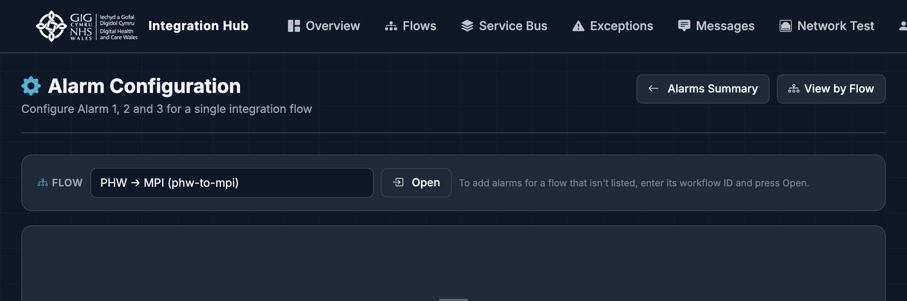

*Figure 2 — Selecting a flow*

> **Tip:** To add alarms for a flow that is not in the list, type its exact workflow ID and
> select **Open**. Workflow IDs can contain only letters, numbers, `_` and `-` (up to 120
> characters). The flow appears in the list once you save a rule for it.

### 4.2 Add a rule

1. Find the section for the alarm type you need, for example **Alarm 1 — Inactivity**.
2. Select **Add Alarm 1 rule** (or **Add Alarm 2 rule** / **Add Alarm 3 rule**).
   A **New rule** panel opens, and the button changes to **Cancel**.
3. Complete the fields:

   | Field | Description |
   |---|---|
   | **Display Name** | The label shown on alarm pages and in alert emails. If you leave it blank, a name is generated for you. |
   | **Enabled** | Leave this on so the rule starts monitoring when you save. |
   | **Thresholds** (Alarms 1 and 2) | The number of minutes without messages before the alarm fires, for each of **Day**, **Eve** and **Wkd**. |
   | **Lookback Window** (Alarm 3) | The number of minutes of history to count failures over. |
   | **Threshold** (Alarm 3) | The number of failures in the window that fires the alarm. |
   | **Alerting Gap** | The minimum number of minutes between repeat alerts. |

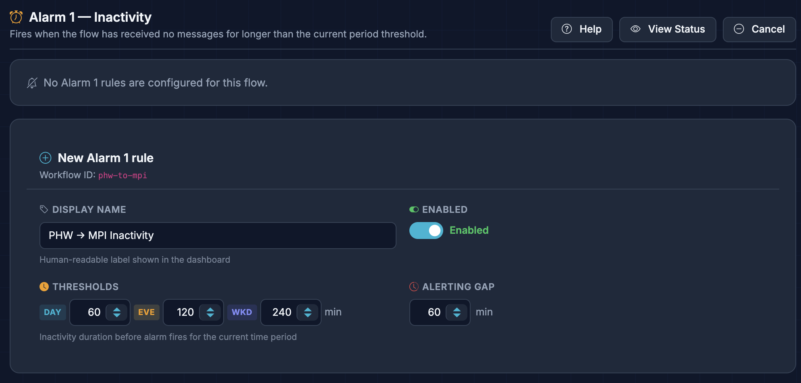

*Figure 3 — New Alarm 1 rule panel*

4. Scroll to the bottom of the page and select **Save Flow Settings**.

A green **Configuration saved successfully** banner confirms the change, and the new rule is
highlighted.

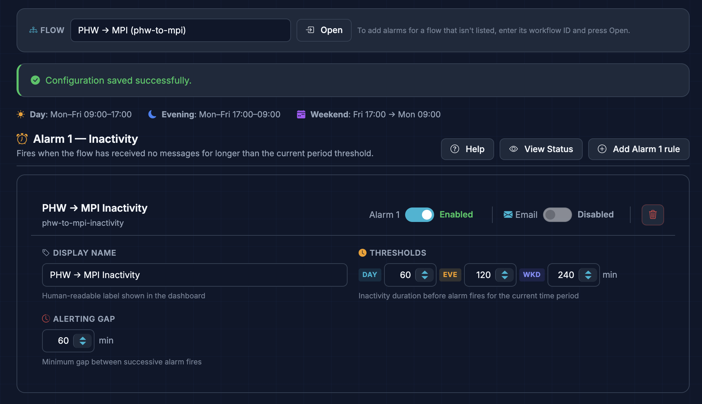

*Figure 4 — The new rule after saving*

> **Note:** You can add rules for more than one alarm type before you save. Only the
> sections you have changed are saved.

### 4.3 Choosing thresholds

- **Busy flows:** use lower Day thresholds and higher Evening and Weekend thresholds to
  reflect natural quiet periods.
- **Alarm 3:** a threshold of `1` alerts on any failure. Raise it, or lengthen the lookback
  window, to ignore occasional one-off failures.
- Use **Alarm 1 and Alarm 2 together** to catch a flow that is still receiving messages but
  has stopped delivering them.

---

## 5. Editing an alarm

1. Open the **Alarm Configuration** page for the flow (see [4.1](#41-open-the-configuration-page-for-a-flow)).

   > **Tip:** On any alarm status page, select the **gear** icon on a rule's row to go
   > straight to that rule.

2. Change any of the following on the rule's card:

   | Control | Effect |
   |---|---|
   | **Alarm 1 / 2 / 3 switch** | Turns evaluation on or off. A disabled rule keeps its settings but never fires. |
   | **Email** switch | Sends an email each time the alarm fires. This switch is greyed out when email alerting is not configured for the dashboard. |
   | **Email OOH** switch | The out-of-hours email preference. This switch is only shown while **Email** is on. |
   | **Display Name**, **Thresholds**, **Lookback Window**, **Threshold**, **Alerting Gap** | Update as required. |

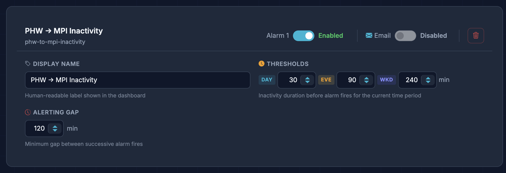

*Figure 5 — Day and Evening thresholds changed on an existing rule*

3. Select **Save Flow Settings**.

> **Important:** If you try to leave the page with unsaved changes, your browser asks you to
> confirm. Always select **Save Flow Settings** before you leave the page.

> **Tip:** For a planned outage, **pause** the rule (see [section 7](#7-pausing-alarms))
> rather than disabling it. A pause records who requested it and why, and it ends
> automatically, so monitoring is not left switched off by mistake.

### 5.1 In-page help

Each alarm section has a **Help** button. It opens a side panel that explains how the alarm
works and what each setting does.

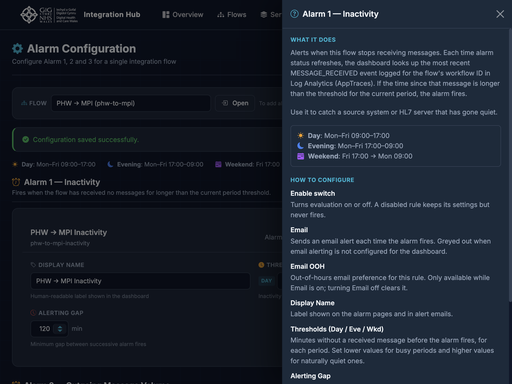

*Figure 6 — Help panel for Alarm 1*

---

## 6. Removing an alarm

1. Open the **Alarm Configuration** page for the flow.
2. On the rule's card, select the **bin** icon.
3. Confirm the prompt: *Remove rule "…"? This will take effect when you save.*
   The card is dimmed and the button changes to **Removing…**.

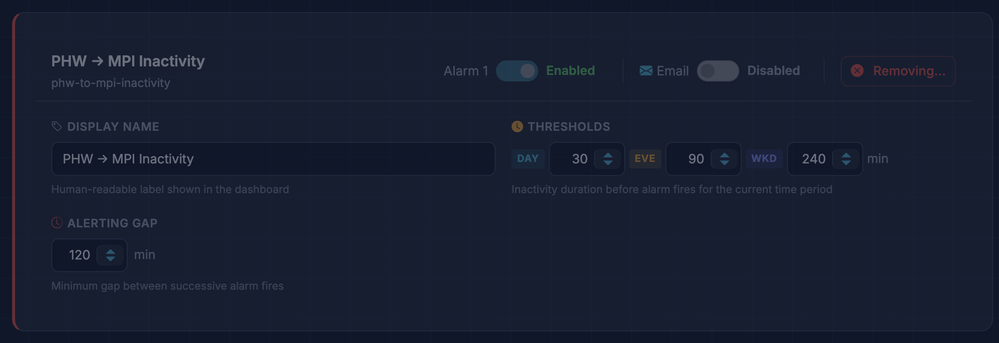

*Figure 7 — A rule marked for removal*

4. Select **Save Flow Settings** to remove the rule permanently.

> **Note:** To undo a removal before you save, reload the page without saving.

---

## 7. Pausing alarms

Pausing stops alarms from firing and sending alerts for a set period. Use a pause for
incidents, maintenance and deployments, when you expect the alarm to fire.

### 7.1 What you can pause

| Scope | What is paused |
|---|---|
| **Single alarm** | One rule, for example *ChemoCare → MPI Inactivity*. |
| **Single flow** | Every alarm type (Inactivity, Volume and Failures) on one flow, **including rules added later**. |
| **Multiple flows** | Every alarm type on each selected flow. |
| **All flows** | Every alarm on every flow. |

### 7.2 Where to start a pause

| Starting point | Scope selected by default |
|---|---|
| **Pause** button (⏸) on a rule's row on an alarm status page | Single alarm (the rule you selected) |
| **Pause this flow** on the **View by Flow** page | Single flow |
| **Schedule pause** on the **Alarm Pauses** page | Single flow (you can change the scope) |

### 7.3 Pause a single alarm now

1. Open the status page for the alarm type, for example **Alarms Summary → Alarm 1 → View
   Details**.

   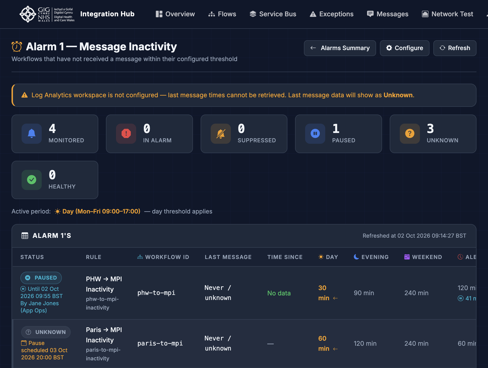

   *Figure 8 — Alarm 1 status page*

2. Scroll the rules table to the right to find the action buttons. Then select **Pause** (⏸)
   on the rule's row.

   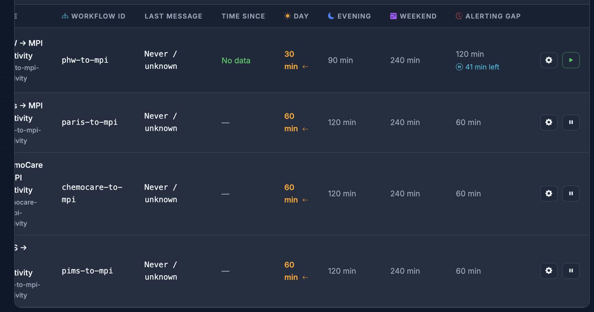

   *Figure 9 — Actions on each rule: **Configure** (gear), **Pause** (⏸) and **Resume** (▶) for a paused rule*

3. In the **Pause Alarms** dialog:
   - **What to pause:** this is already set to **Single alarm** and the rule you selected.
   - **Start:** **Now**.
   - **End:** select **After**, then select a duration (**30 min**, **1 hour**, **2 hours**,
     **4 hours**, **8 hours** or **24 hours**). For a different length, select **Custom…** and
     enter a number with a unit (minutes, hours or days).
   - **Reason** *(required)*: for example the incident or change reference.
   - **Requested by** *(required)*: your name and team.
4. Check the summary line at the bottom of the dialog, for example *Pause ChemoCare → MPI
   Inactivity from now for 2 h.*
5. Select **Pause**.

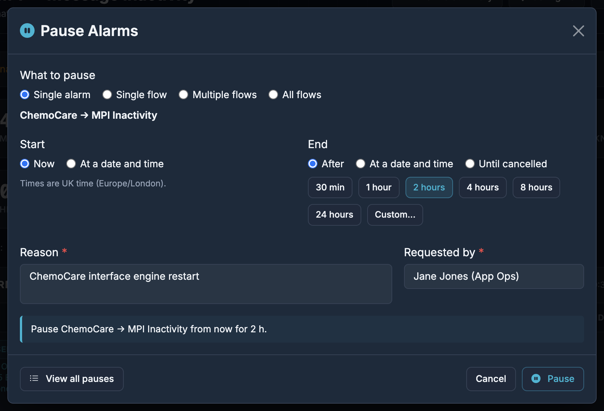

*Figure 10 — Pausing a single alarm for 2 hours*

The rule's status changes to **Paused**. Below the status you will see when the pause ends
and who requested it. The **Alerting Gap** column shows the time remaining.

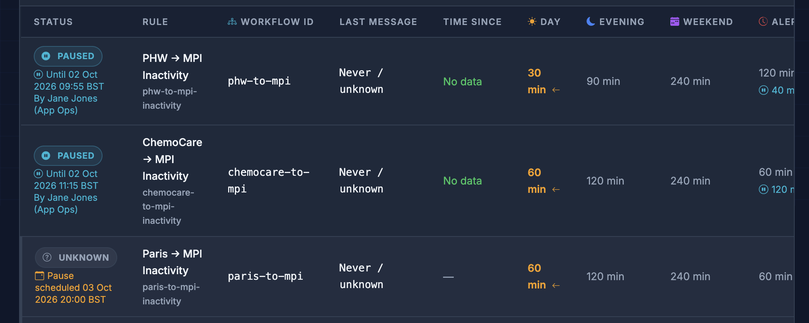

*Figure 11 — Two paused rules, and one rule with a scheduled pause*

### 7.4 Resume a paused alarm early

- **Paused as a single alarm:** select **Resume** (▶) on the rule's row. Monitoring restarts
  straight away.
- **Paused as part of a flow or all-flows pause:** the row shows a **Manage pause** button
  instead. This opens the **Alarm Pauses** page, where you can end the whole pause (see
  [9.2](#92-end-an-active-pause-early)).

> **Note:** You cannot resume a single rule while it is covered by a wider pause. End the wider
> pause instead.

---

## 8. Scheduling a pause

Schedule a pause in advance to cover planned maintenance. The pause starts and ends
automatically. No one needs to take any action at the time.

### 8.1 Schedule a pause for a single flow

1. Open **Alarms → pause indicator → Alarm Pauses**, then select **Schedule pause**.
   Alternatively, select **Pause this flow** on the **View by Flow** page.
2. Set **What to pause** to **Single flow**, then select the flow.
3. Under **Start**, select **At a date and time**, then enter the start date and time.
4. Under **End**, choose one of the following:
   - **After**: a duration from the start time.
   - **At a date and time**: a fixed end time.
   - **Until cancelled**: no end time (see [8.3](#83-indefinite-pauses)).
5. Enter a **Reason** (include the change reference) and **Requested by**.
6. Check the summary line, then select **Schedule pause**.

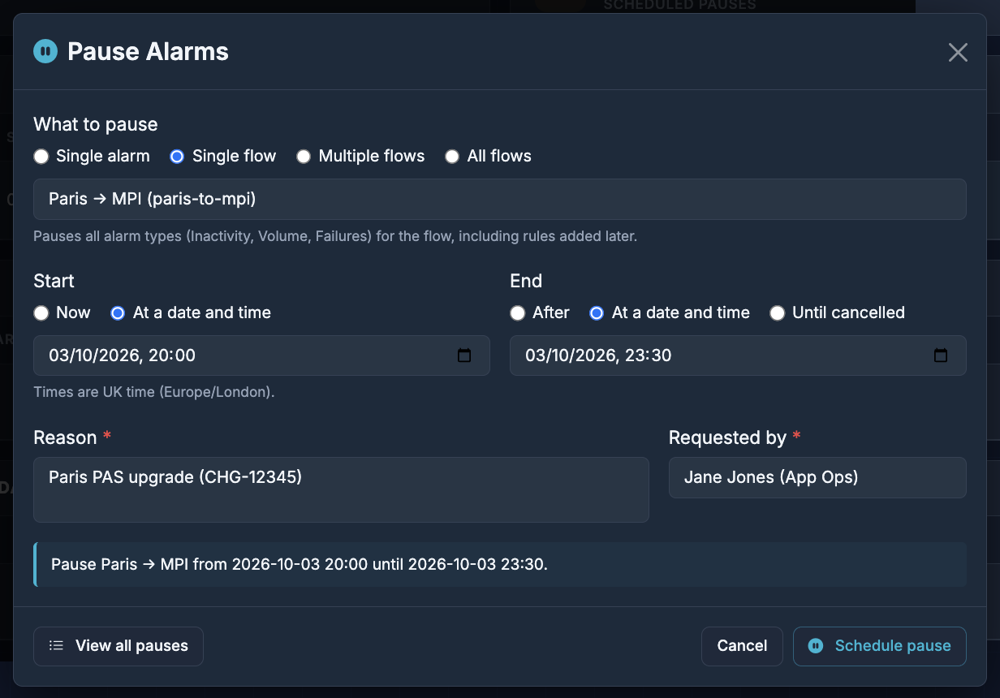

*Figure 12 — Scheduling a pause for the Paris → MPI flow during a planned upgrade*

> **Important:** All times are **UK time (Europe/London)**, whatever time zone your own
> computer uses. The dashboard handles the change between GMT and BST automatically.

### 8.2 Schedule a pause for multiple flows

1. In the **Pause Alarms** dialog, select **Multiple flows**.
2. Select each affected flow. Use **Filter flows…** to search the list.
3. Set the start and end times, the reason and the requester as described in [8.1](#81-schedule-a-pause-for-a-single-flow).
4. Select **Schedule pause**.

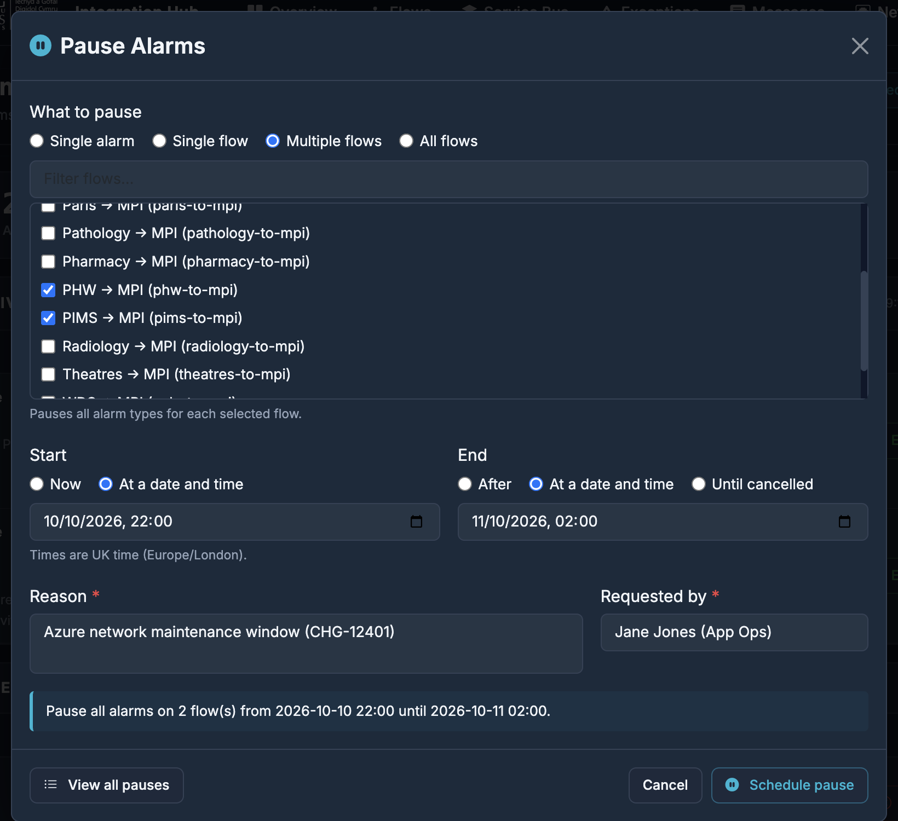

*Figure 13 — Scheduling a pause for two flows during an overnight maintenance window*

### 8.3 Indefinite pauses

If you select **Until cancelled**, the alarms stay paused until someone cancels the pause
manually. The dialog shows a warning when you choose this option.

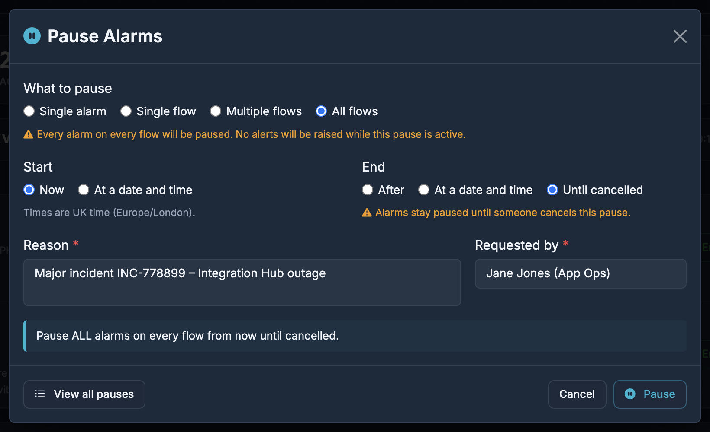

*Figure 14 — The all-flows scope and Until cancelled option, with their warnings*

> **Warning:** **All flows** combined with **Until cancelled** silences every alarm in the
> Integration Hub with no end time. Only use it for a major incident, record the incident
> reference in **Reason**, and end the pause as soon as the incident is resolved.

### 8.4 Validation rules

The dialog will not save a pause, and will show an error, when any of the following applies:

- No flow, flows or rule is selected.
- **Reason** or **Requested by** is empty. These fields allow up to 200 and 100 characters.
- The start time is in the past, or more than 365 days ahead.
- The end time is not after the start time.
- The duration is shorter than 1 minute or longer than 365 days.

---

## 9. Managing pauses

The **Alarm Pauses** page lists every pause in one place. To open it:

- On **Alarms Summary**, select the pause indicator (`N paused · M scheduled`), or
- In the **Pause Alarms** dialog, select **View all pauses**.

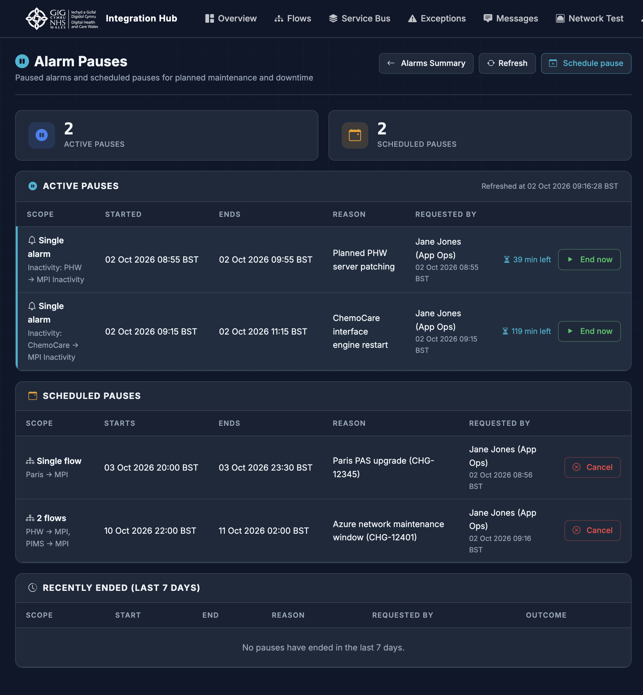

*Figure 15 — Alarm Pauses page*

| Section | Contents |
|---|---|
| **Active pauses** | Pauses in effect now, with the time remaining and an **End now** button. |
| **Scheduled pauses** | Future pauses, with a **Cancel** button. |
| **Recently ended (last 7 days)** | Pauses that finished, ended early or were cancelled, with the outcome. |

Each entry shows the scope, the start and end times, the reason, and who requested the pause
and when.

### 9.1 Cancel a scheduled pause

1. In **Scheduled pauses**, select **Cancel** on the pause.
2. Confirm the prompt: *Cancel this scheduled pause? Alarms will not be paused.*

The pause will not start, and alarms continue to be raised as normal.

### 9.2 End an active pause early

1. In **Active pauses**, select **End now** on the pause.
2. Confirm the prompt: *End this pause now? Alarms will resume immediately.*

Monitoring restarts straight away, and the pause moves to **Recently ended** with the outcome
**Ended early**.

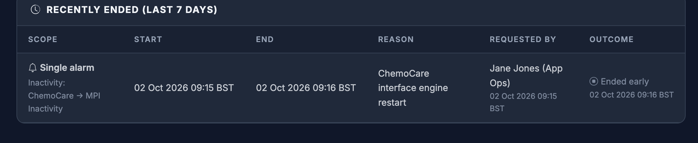

*Figure 16 — A pause that was ended early*

### 9.3 Automatic start and end

- A scheduled pause takes effect at its start time.
- A pause with an end time ends automatically at that time, and monitoring restarts.
- If the alarm condition is still met when the pause ends, the alarm fires as normal.

> **Note:** Alarm status is evaluated whenever the dashboard refreshes. This happens through
> the auto-refresh on the alarm pages, or when you select **Refresh**.

### 9.4 Amending a pause

You cannot edit a pause after you create it. To change it, cancel the pause or end it now, then
create a new one with the correct details.

---

## 10. Where pause status is shown

| Location | What you see |
|---|---|
| **Alarms Summary** and **Overview** | The pause indicator `N paused · M scheduled`, and the **Paused** count on each alarm card. |
| **Alarm status pages** | A **Paused** badge with the end time and requester, or a **Pause scheduled** note with the start time. |
| **View by Flow** | The status of every alarm type for one flow, plus a **Pause this flow** button. |
| **Flows** page | An **Alarms paused** or **Pause scheduled** badge on the affected flow, and a **Paused** badge on each paused alarm. |

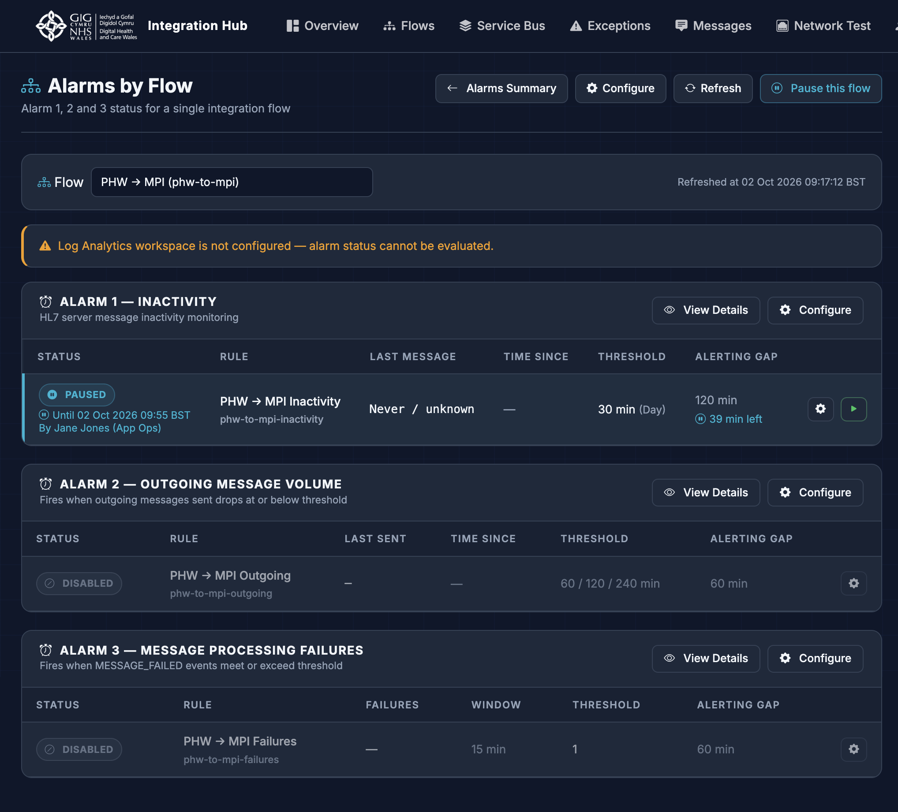

*Figure 17 — View by Flow, showing a paused Alarm 1 rule*

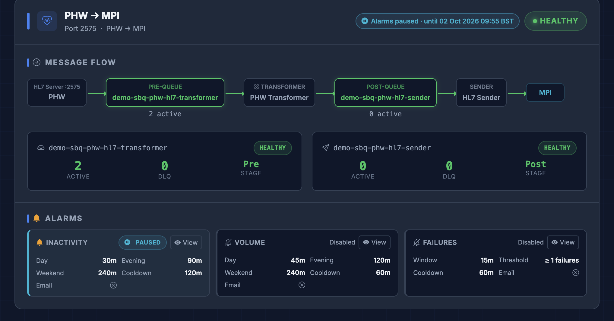

*Figure 18 — The Flows page, showing the "Alarms paused" badge on the PHW → MPI flow*

You can select any pause badge or note to go to that pause on the **Alarm Pauses** page.

---

## 11. Quick reference

| Task | Where | Steps |
|---|---|---|
| Add a rule | **Alarms → Configure** | Select the flow → **Add Alarm N rule** → complete the fields → **Save Flow Settings** |
| Edit a rule | **Alarms → Configure**, or the gear icon on a rule | Change the fields → **Save Flow Settings** |
| Disable a rule | **Alarms → Configure** | Turn off the **Alarm N** switch → **Save Flow Settings** |
| Remove a rule | **Alarms → Configure** | Bin icon → confirm → **Save Flow Settings** |
| Pause one rule now | Alarm status page | ⏸ on the row → set the end time, reason and requester → **Pause** |
| Pause a whole flow | **View by Flow** | **Pause this flow** → complete the dialog → **Pause** |
| Schedule maintenance | **Alarm Pauses** | **Schedule pause** → select the scope → **At a date and time** → **Schedule pause** |
| Resume one rule | Alarm status page | ▶ on the row |
| Cancel or end a pause | **Alarm Pauses** | **Cancel** or **End now** → confirm |

---

## 12. Troubleshooting

| Symptom | Likely cause and action |
|---|---|
| The **Email** switch is greyed out | Email (SMTP) alerting is not configured for this dashboard instance. Contact the dashboard administrator. |
| All rules show **Unknown** | The Log Analytics workspace is not configured, or there has been no message activity in the last 30 days. Check the warning banner at the top of the page. |
| *Invalid workflow ID* error | Use only letters, numbers, `_` and `-`, with no spaces or full stops, up to 120 characters. |
| The ▶ **Resume** button is missing, and a **Manage pause** button is shown instead | The rule is covered by a flow-wide or all-flows pause. End that pause on the **Alarm Pauses** page. |
| *Start time is in the past* | The start time has passed while the dialog was open. Select **Now**, or enter a later time. |
| A pause did not appear | Select **Refresh** on the **Alarm Pauses** page. If it is still missing, check the error shown in the dialog. |
