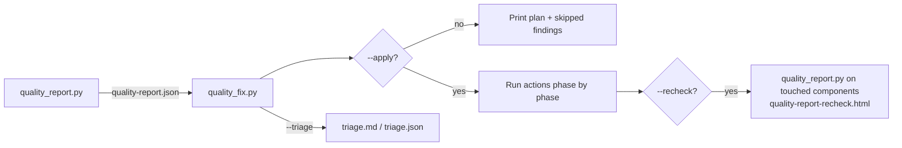

# quality_fix.py — automatic fixes from the quality report

`dev_tools/scripts/quality_fix.py` reads the JSON report written by
[`quality_report.py`](quality_report.py) and fixes the findings that can be
fixed safely. Each kind of fix has its own switch. Anything it can't fix can be
written to a triage list for a person to work through.

- Like `quality_report.py`, it uses only the standard library and runs through
  `uv run --script`.
- By default it does a **dry run**: it prints the plan and changes nothing
  until you pass `--apply`.
- It never commits, pushes or creates branches. Every change is left in your
  working tree as one diff for you to review.

---

## Contents

1. [Quick start](#quick-start)
2. [How it works](#how-it-works)
3. [Command reference](#command-reference)
4. [Fixers in detail](#fixers-in-detail)
5. [Triage list](#triage-list)
6. [Re-checking after a fix](#re-checking-after-a-fix)
7. [Recipes](#recipes)
8. [Safety and undo](#safety-and-undo)
9. [What is not fixed, and why](#what-is-not-fixed-and-why)
10. [Troubleshooting](#troubleshooting)
11. [Developing the script](#developing-the-script)

---

## Quick start

```bash
# 1. Generate (or refresh) the report: dev_tools/reports/quality-report.{html,json}
dev_tools/scripts/quality_report.py

# 2. See what the safe fixers would change (dry run, changes nothing)
dev_tools/scripts/quality_fix.py --safe

# 3. Apply them and re-run the affected checks
dev_tools/scripts/quality_fix.py --safe --apply --recheck

# 4. Review and commit
git diff
```

Run it from the repo root. Paths are worked out from the script's own
location, so running it from another directory also works.

---

## How it works



### Phases

Actions always run in this order:

| Phase | What runs | Why it runs at this point |
|---|---|---|
| 1. Source edits | `--unused-ignores`, `--annotate-none`, `--bandit-timeouts`, `--baseline` | These use the line numbers from the report, so they run before anything can move lines. None of them adds or removes a line. |
| 2. Ruff fixes | `--ruff` / `--ruff-unsafe` | `ruff check --fix` can delete lines, e.g. unused imports. |
| 3. `pyproject.toml` edits | `--audit-pin`, `--audit-transitive`, `--audit-override` | **Every** manifest is edited before any lock file is regenerated (see [why](#why-manifests-are-edited-before-any-locking)). |
| 4. Lock file updates | `--audit` and the other audit switches | Runs `uv lock` once per affected component. |
| 5. Formatting | `--format` | Formats the files changed in the earlier phases. |

### Line numbers and stale reports

Source edits find their target using the `path:line` in the report. Before
editing, every fixer checks that the line still matches what it expects: a
`# type: ignore` comment, a `def`, an HTTP call, and so on. If the line doesn't
match, that one action fails with *"report out of date?"* and the rest of the
run carries on.

If the report's commit differs from `HEAD`, the script warns you:

```text
Report was generated at e781479 but HEAD is 114bd9f; line-based fixes may not match the code.
```

Regenerate the report when you see this, especially before running
`--baseline`.

---

## Command reference

```text
quality_fix.py [components ...] [--report PATH] [--apply] [fixers ...] [--triage FILE] [--recheck] [--allow-dirty]
```

### General

| Switch | Default | Description |
|---|---|---|
| `components` | all in the report | Only fix these components, e.g. `senders/hl7_sender shared_libs/otel_lib`. Each must be a directory with a `pyproject.toml`. |
| `--report PATH` | `dev_tools/reports/quality-report.json` | The report to read. |
| `--apply` | off | Make the changes. Without it, the plan is only printed. |

### Fixers

| Switch | Fixes | Changes |
|---|---|---|
| `--safe` | Shortcut | Same as `--ruff --audit --audit-pin --unused-ignores`. |
| `--ruff` | Ruff findings the report marks as safely fixable | Runs `uv run ruff check . --fix` in each affected component. |
| `--ruff-unsafe` | The above, plus ruff's *unsafe* fixes | Adds `--unsafe-fixes`. Implies `--ruff`. |
| `--format` | Formatting | Runs `uv run ruff format` on the `.py` files changed by this run. |
| `--audit` | Vulnerable packages | Updates `uv.lock` only: `uv lock --upgrade-package pkg==fixed`. |
| `--audit-pin` | Vulnerable packages blocked by a pin or floor | Raises `==` pins and `>=` floors in `pyproject.toml`, including in shared libs, then re-locks. Implies `--audit`. |
| `--audit-transitive` | Vulnerable packages that no `pyproject.toml` declares | Adds a direct `pkg>=fixed` via `uv add --frozen`. Implies `--audit`. |
| `--audit-override` | Same as above | Adds `pkg>=fixed` to `[tool.uv] override-dependencies` instead. Implies `--audit`. Can't be combined with `--audit-transitive`. |
| `--allow-major` | — | Allow audit fixes that need a new major version. |
| `--unused-ignores` | mypy `unused-ignore` | Removes the `# type: ignore` comment, or only its unused codes. |
| `--annotate-none` | mypy `no-untyped-def` where mypy says the function returns nothing | Adds `-> None`. |
| `--bandit-timeouts` | bandit B113 (HTTP request without a timeout) | Adds `timeout=N` to the call. |
| `--timeout-seconds N` | 30 | The timeout value used by `--bandit-timeouts`. |
| `--baseline` | Every *remaining* mypy and bandit finding | Adds `# type: ignore[code]` / `# nosec Bxxx` comments. This hides findings rather than fixing them; see [Baseline](#--baseline). |

### Output and safety

| Switch | Description |
|---|---|
| `--triage FILE` | Writes the findings left for a person. `.md` gives a markdown table per component; `.json` gives machine-readable output. Can be used without any fixer. |
| `--recheck` | After `--apply`, re-runs the affected checks with `quality_report.py` and prints how many findings were fixed, are still there, or are new. |
| `--allow-dirty` | Allows `--apply` when there are uncommitted changes to tracked files. |

### Exit codes

| Code | Meaning |
|---|---|
| `0` | Dry run finished, or every action succeeded. |
| `1` | At least one action failed. The other actions were still applied. |
| `2` | Usage error: no fixer selected, report missing, unknown component, or uncommitted changes without `--allow-dirty`. |

---

## Fixers in detail

### `--ruff` / `--ruff-unsafe`

The report keeps ruff's own fix applicability for each finding (`meta.fix`).
The fixer only runs ruff in components with at least one finding marked `safe`
(or `unsafe` when `--ruff-unsafe` is given):

```text
== Ruff fixes ==
  [ruff] dashboard: `uv run ruff check . --fix` (4 fixable finding(s))
```

This covers the rule families this repo selects (`E,F,W,A,PLC,PLE,PLW,I`).
Typical safe fixes:

| Rule | Example |
|---|---|
| `I001` | Sorts the import block |
| `F401` | Removes an unused import |
| `F541` | `f"text"` with no placeholders → `"text"` |
| `W291` / `W293` | Removes trailing whitespace |

Typical **unsafe** fixes, applied only with `--ruff-unsafe`:

| Rule | Example |
|---|---|
| `E711` | `x == None` → `x is None` |
| `E712` | `x == True` → `x is True` |

Unsafe fixes can change behaviour (for example, `==` vs `is` on custom
classes). Review them.

### `--format`

Runs `uv run ruff format` only on `.py` files that differ from `HEAD`. In
practice these are the files this run changed, because `--apply` refuses to
start when there are uncommitted changes.

> `--format` is **not** part of `--safe`. Not every component is
> `ruff format`-clean yet. Formatting a file reformats all of it, which can
> turn a one-line fix into a large diff.

### `--audit` family

`uv audit` reports each advisory with the installed version and the fixed
versions. For every advisory, the script:

1. **Chooses a target version.** This is the lowest final release in `fixed_in`
   that is newer than the installed version and has the **same major version**.
   - Pre-releases (`rc`, `b`, `a`, `dev`) are ignored.
   - If the only fixes are in a newer major version, the finding is skipped
     unless you pass `--allow-major`.
   - If there is no fix at all, the finding is skipped and appears in triage.
2. **Finds where the package is declared.** It searches the component's
   `pyproject.toml` and every shared lib it pulls in through
   `[tool.uv.sources]` path entries, including shared libs that are pulled in
   by other shared libs. It looks in these sections:
   - `[project] dependencies`
   - `optional-dependencies`
   - `[dependency-groups]`
   - `[tool.uv] dev-dependencies`, `override-dependencies` and
     `constraint-dependencies`
3. **Decides how to fix it:**

| Declared? | Does the declaration allow the fixed version? | `--audit` | `--audit-pin` | `--audit-transitive` / `--audit-override` |
|---|---|---|---|---|
| Yes, e.g. `>=1.38.0` | Yes | Lock only | Raises the floor to `>=fixed`, then locks | — |
| Yes, e.g. `==7.14.3` | No | **Skipped**: "use --audit-pin" | Moves the pin to `==fixed`, then locks | — |
| Yes, with an upper bound such as `<2` that excludes the fix | No | Skipped | **Skipped** with the reason | — |
| No (comes in through another package) | — | Lock only | Lock only | Adds a `pkg>=fixed` requirement, then locks |

#### How requirements are rewritten

The existing style of each requirement is kept:

| Before | Target | After |
|---|---|---|
| `azure-servicebus==7.14.3` | 7.14.5 | `azure-servicebus==7.14.5` |
| `azure-core>=1.38.0` | 1.38.2 | `azure-core>=1.38.2` |
| `azure-core>=1.38.0,<2` | 1.38.2 | `azure-core>=1.38.2,<2` |
| `requests` | 2.32.4 | `requests>=2.32.4` |
| `pkg~=2.32.0` | 2.32.4 | `pkg~=2.32.4` |
| `pkg~=2.30` | 2.32.4 | `pkg~=2.30,>=2.32.4` (keeps the original upper bound) |
| `uvicorn[standard]>=0.30; python_version >= '3.13'` | 0.37.1 | `uvicorn[standard]>=0.37.1; python_version >= '3.13'` |
| `pkg>=1,<1.0.2` | 1.0.2 | **blocked**: `'<1.0.2' excludes 1.0.2` |
| `pkg @ https://…` | any | **blocked**: URL requirements are never edited |

Edits replace the quoted string in place, so comments, ordering and layout in
`pyproject.toml` are kept. The file is then parsed with `tomllib` to confirm the
result is valid TOML and the new requirement is present. If not, the file is
left unchanged.

#### Shared libs

Suppose `azure-servicebus==7.14.3` is pinned in `shared_libs/message_bus_lib`
and the advisory is reported against `senders/hl7_sender`. The fixer then:

1. edits **`shared_libs/message_bus_lib/pyproject.toml`** once, even when
   several components report the same advisory; and
2. re-locks **every** component that pulls in `message_bus_lib`, directly or
   through another shared lib. This includes components that weren't in the
   report or that you filtered out. If several consumers need different
   targets, the highest one wins.

#### Why manifests are edited before any locking

Each component's `uv.lock` stores a copy of the `requires-dist` metadata of
every shared lib it uses through a path dependency. If a dependent were locked
before its shared lib's manifest had been edited, its lock file would keep the
old metadata, and CI's `--locked` checks would fail. That's why phase 3 (all
manifest edits) finishes before phase 4 (all `uv lock` runs). This is the same
approach as `upgrade-package.ps1`.

#### Lock commands

```text
uv --native-tls lock --upgrade-package anyio==4.15.1
```

- `--upgrade-package pkg==version` upgrades exactly that package to exactly
  that version and leaves everything else in the lock alone.
- Dependents that weren't in the report get `--upgrade-package` only for the
  packages actually present in their own `uv.lock`, otherwise a plain
  `uv lock`.
- `--native-tls` matches the other scripts and works behind the corporate TLS
  proxy. Newer uv versions print a deprecation warning for it; the warning is
  harmless.

#### `--audit-transitive` vs `--audit-override`

These apply when the vulnerable package isn't declared anywhere, because it
comes in through another package.

| | `--audit-transitive` | `--audit-override` |
|---|---|---|
| Adds | `pkg>=fixed` to `[project] dependencies` (via `uv add --frozen`) | `pkg>=fixed` to `[tool.uv] override-dependencies` |
| Effect | Normal requirement, combined with the other packages' own requirements | **Replaces** every other requirement on that package, including upper bounds set by other packages |
| Existing examples in this repo | `urllib3>=2.8.0`, `setuptools>=83.0.0` in shared libs | `dashboard` (`setuptools`), `dev_tools/buswatch` (`anyio`) |
| Use when | Default choice | A dependency's own upper bound blocks the fix and you accept the risk |

The requirement is added to the component where the advisory was reported. If
that component is a shared lib, every component that uses it is re-locked too.

#### Example

```text
$ dev_tools/scripts/quality_fix.py --audit-pin --apply dev_tools/buswatch

== pyproject.toml edits ==
  OK     [audit-pin] dev_tools/buswatch: dev_tools/buswatch/pyproject.toml: 'anyio>=4.14.2' -> 'anyio>=4.15.1'

== Lock file updates ==
  OK     [audit] dev_tools/buswatch: `uv --native-tls lock --upgrade-package anyio==4.15.1`

2 action(s) applied, 0 failed. Review with `git diff`; undo with `git restore .`.
```

### `--unused-ignores`

This fixes mypy's `unused-ignore` findings. mypy only reports these when
`warn_unused_ignores` is enabled, so this fixer has nothing to do until that
option is turned on.

| Before | mypy says | After |
|---|---|---|
| `x = f()  # type: ignore[arg-type]` | `Unused "type: ignore" comment` | `x = f()` |
| `x = f()  # type: ignore[arg-type, misc]  # noqa: E501` | `Unused "type: ignore[misc]" comment` | `x = f()  # type: ignore[arg-type]  # noqa: E501` |

Other comments on the line are kept.

### `--annotate-none`

This fixes only the `no-untyped-def` findings where mypy's message is
*"Function is missing a return type annotation"* **and** mypy adds the note
*Use "-> None" if function does not return a value*. Before editing, the
script checks the function's syntax tree again:

- there is no existing return annotation;
- there is no `return <value>` other than `return None`; and
- there is no `yield`. `return`/`yield` inside nested functions, lambdas or
  classes don't count.

```python
# before
def _on_close(self):
    self.destroy()

# after
def _on_close(self) -> None:
    self.destroy()
```

Signatures that span several lines are handled. Findings about **unannotated
arguments** (*"Function is missing a type annotation"*) are left alone, because
adding `-> None` there would only change which error mypy reports.

### `--bandit-timeouts`

This fixes bandit B113 (*Call to requests without timeout*). The script adds
`timeout=N` after the call's last argument, using `--timeout-seconds`
(default 30):

```python
requests.get(url, headers=h)          ->  requests.get(url, headers=h, timeout=30)
requests.get()                        ->  requests.get(timeout=30)
requests.post(                        ->  requests.post(
    url,                                      url,
    json=body,                                json=body, timeout=30,
)                                         )
```

It refuses calls that pass `**kwargs`, because those may already contain a
timeout; fix those by hand. Use `--format` if you want ruff to tidy the layout
afterwards.

### `--baseline`

`--baseline` adds suppression comments for **every mypy and bandit finding
that no other selected fixer handled**. Each affected line gets one combined
comment:

```python
def set(self, lo: str, hi: str) -> None:  # type: ignore[override]
with urllib.request.urlopen(req, timeout=10) as resp:  # nosec B310
```

- Codes are merged with any existing `# type: ignore[...]` or `# nosec ...` on
  the line.
- `# type: ignore[...]` is always placed first in the comment, because mypy
  only recognises it there. Comments such as `# noqa` are kept after it.
- A bare `# type: ignore` or `# nosec` already covers everything, so the line
  is left unchanged.
- Lines inside multi-line strings and lines ending in a `\` continuation are
  refused.

> ⚠️ **This hides findings; it does not fix them.** Use it to adopt a new rule
> on old code, or to get CI green while a real fix is tracked elsewhere. Write
> a triage list first (`--triage`) so the suppressed items are recorded. Check
> the diff for security suppressions (`# nosec`) especially carefully.

---

## Triage list

`--triage FILE` writes every finding that is left after the selected fixers,
on the assumption that their actions succeed. It includes:

- findings that no selected fixer handles;
- findings a fixer skipped, with the reason (e.g. *"the fix needs a major
  upgrade to 3.0.1 (use --allow-major)"*);
- findings a fixer *could* handle but you didn't select. Their Note says which
  switch, e.g. *"auto-fixable with --ruff"*;
- with `--apply`, findings whose fix **failed**, with the error; and
- checks that couldn't run at all (`check-error`).

```bash
# Only the triage list, no fixing
dev_tools/scripts/quality_fix.py --triage dev_tools/reports/triage.md

# What would still need a person after the safe fixers?
dev_tools/scripts/quality_fix.py --safe --triage dev_tools/reports/triage.md

# Machine-readable, e.g. to raise ADO work items
dev_tools/scripts/quality_fix.py --triage dev_tools/reports/triage.json
```

Example markdown output:

```markdown
Findings remaining: **11** (bandit 2, mypy 8, ruff 1; 1 auto-fixable with: --ruff).

## dev_tools/integration_hub_tester

| Check | Location | Code | Message | Note |
|---|---|---|---|---|
| bandit | `dev_tools/integration_hub_tester/services/soap_sender_plugin.py:168` | [B310](https://…) | Audit url open for permitted schemes… |  |
| mypy | `dev_tools/integration_hub_tester/app.py:144:18` | [override](https://…) | Argument 1 of "set" is incompatible with supertype… |  |
```

`dev_tools/reports/` is gitignored, so triage files written there are never
committed by accident.

---

## Re-checking after a fix

With `--apply --recheck`, the script runs `quality_report.py` again, but only
for the components it touched. This includes components re-locked because
they use an edited shared lib. Only these check groups are run:

| Fixers that ran | Groups re-run |
|---|---|
| `--ruff`, `--format` | `ruff` |
| `--unused-ignores`, `--annotate-none` | `mypy` |
| `--bandit-timeouts`, any `--audit*` | `security` |
| `--baseline` | `mypy`, `security` |
| any of the above | `tests` (always, because any change can break a test) |

The results go to `dev_tools/reports/quality-report-recheck.{html,json}`, so
your full report isn't overwritten. The script then prints a comparison.
Findings are compared by file, code and message rather than line number,
because lines move when code is edited:

```text
Component                                     Check    Fixed Remaining   New
dev_tools/integration_hub_tester              mypy         8         0     0
dev_tools/integration_hub_tester              bandit       2         0     0
```

---

## Recipes

**Routine tidy-up before raising a PR**

```bash
dev_tools/scripts/quality_report.py --checks ruff,mypy
dev_tools/scripts/quality_fix.py --ruff --unused-ignores --annotate-none --apply --recheck
```

**A new CVE is reported against a shared dependency**

```bash
dev_tools/scripts/quality_report.py --checks security
dev_tools/scripts/quality_fix.py --audit-pin                       # review the plan first
dev_tools/scripts/quality_fix.py --audit-pin --apply --recheck     # edits manifests, relocks, re-tests
git diff -- '*.toml'                                               # check every pin/floor change
```

**The fix is only in a newer major version**

```bash
dev_tools/scripts/quality_fix.py --audit-pin --allow-major            # see what would change
dev_tools/scripts/quality_fix.py --audit-pin --allow-major --apply --recheck
```

Read the package's changelog before accepting a major upgrade.

**A vulnerable transitive dependency that the lock file alone can't upgrade**

```bash
dev_tools/scripts/quality_fix.py --audit-transitive --apply --recheck
# or, if another package's upper bound blocks it:
dev_tools/scripts/quality_fix.py --audit-override --apply --recheck
```

**One component only**

```bash
dev_tools/scripts/quality_fix.py --safe --apply senders/hl7_sender
```

Shared-lib edits still re-lock every component that uses the shared lib, even
components outside the filter.

**Adopting a new mypy rule on existing code**

```bash
dev_tools/scripts/quality_report.py --checks mypy
dev_tools/scripts/quality_fix.py --triage dev_tools/reports/mypy-baseline.md   # record what will be hidden
dev_tools/scripts/quality_fix.py --unused-ignores --annotate-none --baseline --apply --recheck
```

**Everything automatic, with formatting**

```bash
dev_tools/scripts/quality_fix.py --safe --annotate-none --bandit-timeouts --format \
    --triage dev_tools/reports/triage.md --apply --recheck
```

---

## Safety and undo

- **Dry run by default.** Nothing changes without `--apply`.
- **Working tree must have no uncommitted changes.** `--apply` refuses to run
  when tracked files have uncommitted changes, so `git diff` afterwards shows
  exactly what the script did. Untracked files are ignored. `--allow-dirty`
  overrides this; `--format` then also formats files you had already changed.
- **Each action is checked.** Python edits are re-parsed with `ast` and must
  keep the same line count. TOML edits are re-parsed with `tomllib`. A failed
  check leaves that file unchanged.
- **Failures are isolated.** One failed action doesn't stop the run; it is
  reported, and its findings go back into the triage list.
- **Input from the report is validated.**
  - File paths must point to `.py` files inside the repo.
  - Package names and versions must match strict patterns before they are
    passed to `uv`.
  - Commands are always run as argument lists, never through a shell.
- **Undo:**

  ```bash
  git restore .                       # discard every change the script made
  git restore -- shared_libs/otel_lib # or just one component
  ```

---

## What is not fixed, and why

| Finding | Why it isn't automated |
|---|---|
| Most mypy errors (`override`, `arg-type`, `misc`, `func-returns-value`, …) | The fix depends on what the code is meant to do. Use `--triage`, or `--baseline` to suppress. |
| mypy `import-untyped` (missing `types-*` stubs) | CI runs mypy through `uv tool run`, in its own isolated environment. Adding `types-*` to a component's dev group therefore wouldn't change CI's result. Run mypy with `--ignore-missing-imports`, as CI does. |
| Most bandit findings (e.g. B310 `urlopen`) | The right fix, such as restricting allowed URL schemes, depends on context. |
| Test failures | Need a person. Run `--recheck` to tell real failures apart from failures caused by your change. |
| Advisories with no fixed release | Nothing to upgrade to. They appear in triage with a link to the advisory. |
| `adverse-status` audit entries | Usually a yanked or deprecated package; needs a decision. |

---

## Troubleshooting

| Symptom | Cause / fix |
|---|---|
| `Report ... not found` | Run `dev_tools/scripts/quality_report.py` first, or pass `--report`. |
| `Uncommitted changes in the working tree` | Commit or stash, or pass `--allow-dirty`. |
| `... (report out of date?)` | The code changed after the report was generated. Regenerate the report. |
| `'<2' excludes 2.0.1` | An upper bound blocks the fix. Edit the bound by hand, or use `--audit-override` if the requirement isn't declared directly. |
| `the fix needs a major upgrade ... (use --allow-major)` | Read the changelog, then re-run with `--allow-major`. |
| `uv ... lock exited 1` | The resolver couldn't satisfy the new version. The `uv` output is shown under the failure. Usually another package's upper bound is the cause. |
| `The --native-tls flag is deprecated` | Harmless warning from newer uv versions. |
| `--unused-ignores` does nothing | mypy only reports unused ignores when `warn_unused_ignores` is on. |
| A `# type: ignore` added by `--baseline` doesn't silence mypy | mypy reports the error on another line of a multi-line statement. Move the comment to the reported line. |

---

## Developing the script

The tests use `unittest` and live next to the `quality_report.py` tests. They
are not picked up by `run-all-tests.sh`:

```bash
cd dev_tools/scripts
uv run --python 3.13 python -m unittest discover tests
uv tool run ruff check --target-version py313 --line-length 120 --select E,F,W,A,PLC,PLE,PLW,I quality_fix.py tests
uv tool run --python 3.13 mypy quality_fix.py tests/test_quality_fix.py --ignore-missing-imports
```

To add a new fixer:

1. Write an edit function, modelled on `add_none_return`, with the signature
   `(path, line, ...) -> str`. It should raise `FixError` when the code doesn't
   match what it expects, and call `_write_validated` to write the file.
2. Add a `plan_*` function, or a branch in `plan_line_fixes`, that turns report
   findings into `Action`s in the right phase. Record which findings each
   action handles.
3. Add a switch in `parse_args` and `options_from_args`, add an entry to
   `RECHECK_GROUPS`, and document it here.
4. Add unit tests that cover both a successful edit and the "report out of
   date" case.
