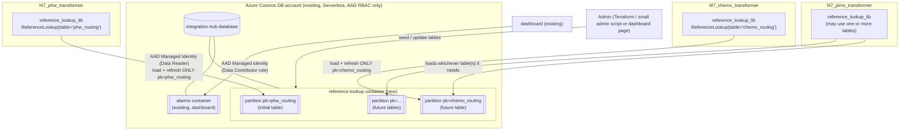
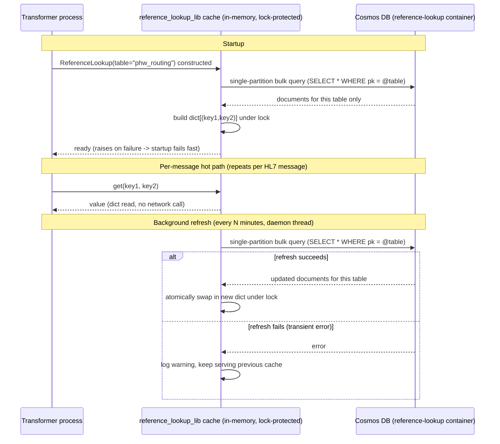
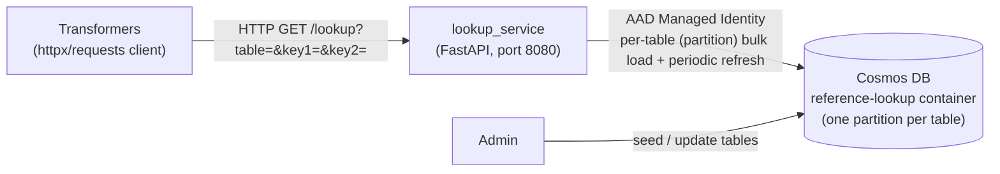
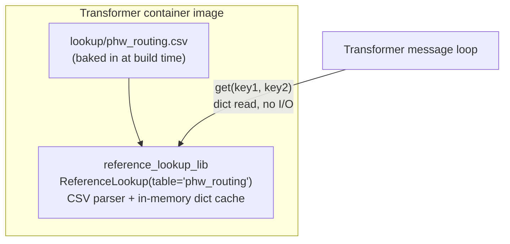
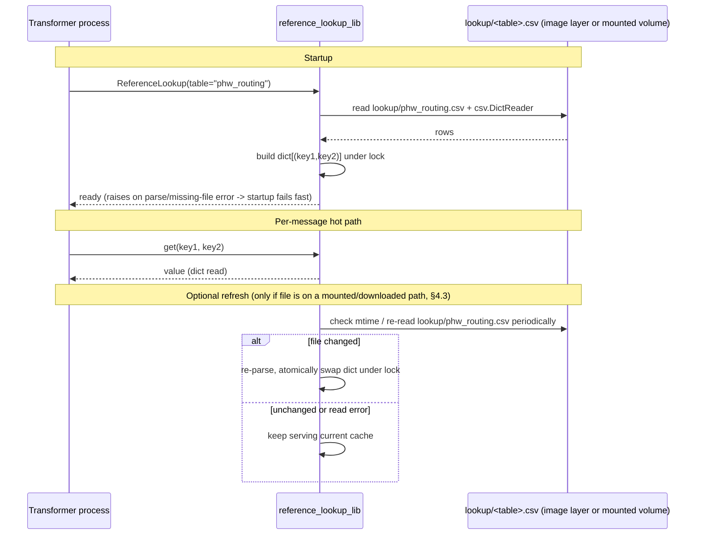
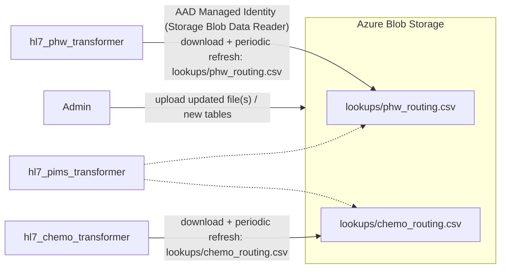
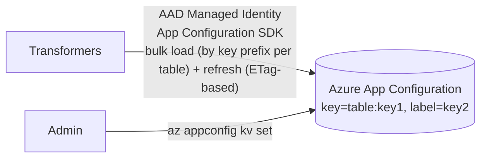
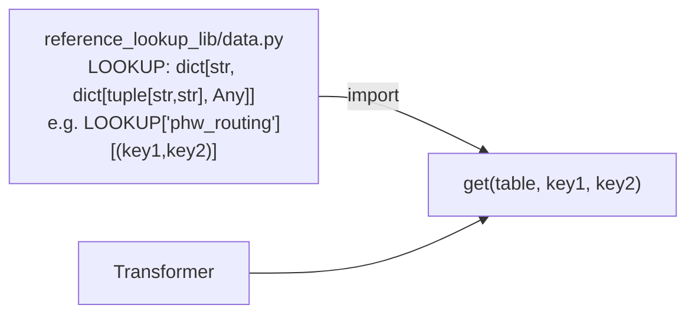
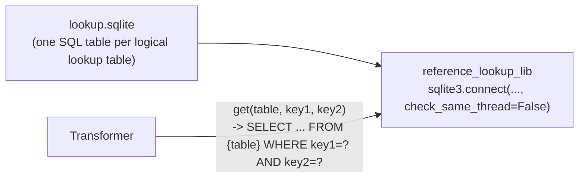

# Reference Lookup Service — Cosmos DB Suitability Report & Implementation Plan

**Spec source:** [`cosmos_lookup.md`](../cosmos_lookup.md)
**Requirement:** replace the old SQL Server + stored-procedure lookup (used to resolve
values keyed on two fields) with a fast, thread-safe, performant lookup usable from
every transformer container.

**Updated spec (2026-09-03):**
- Initially there is **one lookup table**, referenced by a table name/key. More
  lookup tables will be added in future.
- The **number of items per table is unknown** — no longer assumed to be a fixed
  small count. The design must not silently degrade if a table turns out to be large.
- **Different transformers use different lookup tables** — a transformer should only
  need to load/cache the table(s) it actually uses, not every table that exists.

---

## 1. Suitability Report — Using the Existing Cosmos DB Account

### 1.1 What we already have

The dashboard already uses Cosmos DB for alarm config/state persistence
([`dashboard/dashboard/services/cosmos_store.py`](../dashboard/dashboard/services/cosmos_store.py),
provisioned by
[`modules/terraform-azurerm-cosmosdb`](../../Integration-Hub-Terraform/modules/terraform-azurerm-cosmosdb)
from
[`components/app-platform/cosmosdb.tf`](../../Integration-Hub-Terraform/components/app-platform/cosmosdb.tf)):

| Aspect | Current configuration |
|---|---|
| Capacity mode | `Serverless` (pay-per-request, no idle cost) |
| Consistency | `Session` (default) |
| Auth | `local_authentication_disabled = true` → Microsoft Entra ID (AAD) data-plane RBAC only, via Managed Identity; no account keys in cloud |
| Container | Single `alarms` container, partition key `/pk`, a handful of documents |
| Client | `azure-cosmos` sync SDK, process-wide singleton, thread-safe via `threading.Lock` |
| Failure behaviour | Errors are logged and swallowed — reads return `None`, writes are skipped, app degrades gracefully |
| Environments | Deployed in DEV/TST (UAT currently disabled via `deploy_noc_dashboard_cosmos = false`) |

### 1.2 Is Cosmos DB suitable for this new requirement?

**Yes — technically well suited, with one important architectural caveat.**

**Positives**
- **Already provisioned and operated.** No new Azure service to approve/govern; the
  Terraform module already supports adding another database/container to the same
  account (`containers` is a map — see [§2.3](#23-terraform-changes)).
- **Point reads are cheap and fast.** A read by `id` + partition key is a single-digit
  millisecond, ~1 RU operation, and a **partition-scoped query** (all rows for one
  table) is a single round trip regardless of how many other tables exist in the
  container.
- **Partitioning by table name scales cleanly with the updated spec.** Using each
  lookup table's name as the Cosmos partition key (see [§2.2](#22-data-model)) means
  every table's rows live in their own logical partition — adding a new table, or one
  table growing much larger than expected, never affects the cost or performance of
  looking up a different table.
- **RBAC model fits.** Managed Identity + Cosmos Data Reader role matches the existing
  "no secrets in code" convention in this repo.
- **Serverless remains the right capacity mode** — the workload is low-volume and
  read-heavy with infrequent writes (admin updates values), exactly what Serverless is
  designed for. No provisioned RU/autoscale is needed at this scale.
- **Document model fits a 2-key lookup, split across multiple tables, naturally** —
  see schema in [§2.2](#22-data-model).

**The caveat: don't put Cosmos in the per-message hot path**

Transformers (`hl7_phw_transformer`, `hl7_chemo_transformer`, `hl7_pims_transformer`)
are currently pure Azure Service Bus consumers — they have **no outbound network
dependency** other than Service Bus itself
(`transformer_base_lib` → `message_bus_lib`). Calling Cosmos on *every processed
message* (whether directly or via a new HTTP microservice) would:

- Add a new external dependency + latency (network round trip) to every message.
- Introduce a new failure mode: a transient Cosmos/network blip could stall or fail
  message processing that today only depends on Service Bus.
- Be unnecessary RU spend for data that changes rarely, however large any individual
  table turns out to be.

Given a low-churn dataset, the right pattern is **not** "call Cosmos per lookup" but
**"load the table(s) a transformer actually uses into memory once, refresh
periodically, and serve lookups from an in-process cache"** — the same trade-off
already made for `alarms`. Because item counts per table are now unknown, each
transformer caching **only the table(s) it needs** (rather than the whole container)
keeps this safe even if one table turns out to be much larger than another — see
[§2.4](#24-new-shared-library-shared_libsreference_lookup_lib) and the capacity-planning
note in [§2.7](#27-thread-safety--performance-summary).

### 1.3 Recommendation

Use the **existing Cosmos DB account**, add a **new container** (e.g. `reference-lookup`)
in the existing `integration-hub` database (or a sibling database if stricter
separation from dashboard data is preferred), and access it through a **new shared
library** (`shared_libs/reference_lookup_lib/`) that each transformer depends on
directly — rather than a new standalone microservice. Details in §2.

A single container holds **every** lookup table, distinguished by partition key
(§2.2) — adding a second, third, ... table later is a data change (a new partition
value), not a schema or Terraform change.

This avoids introducing HTTP as a brand-new inter-service dependency and keeps the
per-message hot path entirely in-process (a dict lookup), while reusing the exact
Cosmos client/RBAC/thread-safety pattern already proven in `cosmos_store.py`.

A future move to a dedicated microservice (Option B, discussed in §4) remains possible
later without re-architecting the data layer, if requirements grow (much larger
dataset, need for centralised audit/administration, or cross-language consumers).

---

## 2. Implementation Plan

### 2.1 Architecture



### 2.2 Data model

Each lookup table is a Cosmos **partition**, and rows within a table are resolved by
the two lookup keys from the original spec:

```json
{
  "id": "<key1>::<key2>",
  "pk": "<table name, e.g. \"phw_routing\">",
  "table": "<table name>",
  "key1": "<key1 value>",
  "key2": "<key2 value>",
  "value": { "...": "whatever the transformer needs" },
  "updatedAt": "2026-09-02T10:00:00Z"
}
```

- **Partition key = table name** (path `/pk`). This is the key design change driven
  by the updated spec: since more tables will be added and item counts per table are
  unknown, using the table name as the partition key means:
  - A transformer's bulk-load/refresh query is a **single-partition point query**
    (`SELECT * FROM c WHERE c.pk = @table`) — cheap and fast regardless of how many
    *other* tables exist in the container.
  - A table that turns out to be much larger than expected only affects that
    table's own partition (Cosmos's 20 GB/logical-partition limit applies per table,
    not per container) — it can't degrade or crowd out other tables.
  - Adding a new table later is purely a data change (a new `pk` value) — no
    Terraform or schema change required.
- **id:** composite of the two lookup keys (`f"{key1}::{key2}"`), unique within a
  table/partition, giving an O(1) point read if a single-row lookup is ever needed
  without loading the whole table.
- **table:** duplicated onto the document (alongside `pk`) purely for
  readability/debugging when inspecting documents directly — `pk` remains the
  authoritative partition key.
- **value:** free-form payload — whatever the transformers need to look up (kept
  schema-flexible; Cosmos is schemaless).

### 2.3 Terraform changes

Add a new container entry to the existing module call in
[`components/app-platform/cosmosdb.tf`](../../Integration-Hub-Terraform/components/app-platform/cosmosdb.tf):

```hcl
module "noc_dashboard_cosmos" {
  # ...existing config unchanged...

  containers = {
    alarms = {
      name               = local.noc_dashboard_cosmos_container_name
      partition_key_path = "/pk"
    }
    reference_lookup = {
      name               = "reference-lookup"
      partition_key_path = "/pk"
    }
  }

  data_reader_principal_ids = concat(
    var.reference_lookup_data_reader_principal_ids, # transformer managed identities — read only
    var.noc_dashboard_cosmos_data_reader_principal_ids,
  )
}
```

- Grant **Cosmos DB Built-in Data Reader** (not Contributor) to each transformer's
  managed identity — least privilege, since transformers only ever read reference data.
- Reuse the *same account* (no new account/module needed) — only a new container and
  new `data_reader_principal_ids` entries per environment `.tfvars`
  (`app-platform-dev.tfvars`, `-tst.tfvars`, etc.), following the existing pattern.
- Renaming the module's `deploy_noc_dashboard_cosmos` flag is **not** required — the
  new container rides on the same account; only rename if the account is considered
  no longer "NOC-dashboard-only" (cosmetic, optional follow-up).

A single `reference-lookup` container holds **every** lookup table — new tables are
added by writing documents with a new `pk` value, not by changing Terraform. RBAC
(`data_reader_principal_ids`) is still granted per Managed Identity at the container
level; if a transformer must only ever read its own table, that boundary is enforced
at the application layer (which `table` name it asks for via `reference_lookup_lib`),
since Cosmos SQL API RBAC roles don't scope below the container.

### 2.4 New shared library: `shared_libs/reference_lookup_lib/`

Following the existing `shared_libs/*` structure and the client/thread-safety pattern
from `cosmos_store.py`:

```
shared_libs/reference_lookup_lib/
├── pyproject.toml
├── reference_lookup_lib/
│   ├── __init__.py
│   ├── client.py          # CosmosClient singleton (mirrors cosmos_store.py)
│   ├── cache.py           # thread-safe in-memory cache + refresh loop
│   └── lookup_service.py  # public API: get(key1, key2) -> value | None
└── tests/
    └── test_lookup_service.py
```

**Public API (consumed by transformers):**

```python
from reference_lookup_lib import ReferenceLookup

# One instance per table a transformer needs -- each caches only its own partition.
phw_routing = ReferenceLookup(table="phw_routing", refresh_interval_seconds=300)
value = phw_routing.get(key1, key2)  # in-memory dict read -- no network call on the hot path

# A transformer that needs more than one table simply creates more than one instance:
chemo_routing = ReferenceLookup(table="chemo_routing")
```

**Design:**
- Each `ReferenceLookup` instance is scoped to **one table** (one Cosmos partition),
  so a transformer only ever loads/caches the table(s) it actually uses — never the
  whole container, and never another transformer's table.
- On construction, perform a **single-partition bulk load**
  (`SELECT * FROM c WHERE c.pk = @table`) into a local `dict[tuple[str, str], Any]`
  keyed by `(key1, key2)`.
- A background daemon thread refreshes the cache every `refresh_interval_seconds`
  (configurable; default a few minutes — the dataset changes rarely).
- All reads/writes to the cache go through a `threading.RLock`, matching the
  `_client_lock` pattern in `cosmos_store.py`, so concurrent transformer worker
  threads/processes can call `.get()` safely.
- **Graceful degradation:** if a background refresh fails (Cosmos transient error),
  log via `event_logger_lib` and **keep serving the last-known-good cache** rather
  than raising — a transient Cosmos outage must never stop message processing.
- On the very first load (process startup) a failure *should* raise, so the container
  fails a startup/health check rather than silently running with an empty lookup table.
- **Unknown/large table size guardrail:** log a warning (via `event_logger_lib`) if a
  single table's row count exceeds a configurable threshold (e.g. 10,000 rows) on
  load. This doesn't block startup, but flags early if a table is growing well beyond
  the "small reference data" assumption this design is built for, so it can be
  revisited (e.g. move that one table to per-lookup point reads instead of
  full-table caching) before it becomes a real memory concern.

### 2.5 Sequence — startup load, periodic refresh, and per-message lookup



### 2.6 Consuming from transformers

Add `reference-lookup-lib` as a local `uv` source dependency, exactly like other
shared libs:

```toml
[tool.uv.sources]
reference-lookup-lib = { path = "../shared_libs/reference_lookup_lib" }
```

Instantiate once at process startup (alongside the existing `BaseTransformer` /
Service Bus client setup in each transformer's `application.py`), not per message —
mirrors how `message_bus_lib` clients are created once and reused.

### 2.7 Thread-safety & performance summary

| Concern | Mitigation |
|---|---|
| Concurrent reads from multiple worker threads | Cache reads happen through a `threading.RLock`-protected dict snapshot; reads never block on network I/O |
| Cache refresh racing with reads | Build the new dict fully before atomically swapping the reference under the lock (readers never see a partially-populated cache) |
| Per-message latency | O(1) dict lookup (~microseconds) — no Cosmos round trip in the hot path |
| Cosmos outage | Startup fails fast (fail-closed); runtime refresh failures fall back to last-known-good cache (fail-open) — matches `cosmos_store.py`'s graceful-degradation philosophy |
| RU cost | Bulk refresh of one table's partition every few minutes — cost scales with that table's row count, not the whole container; negligible on Serverless at typical reference-data volumes |
| Data staleness | Bounded by `refresh_interval_seconds` (e.g. 5 min) — acceptable for reference/config-style data; a manual "force refresh" signal (e.g. SIGHUP or a small admin endpoint) can be added later if near-instant propagation is ever required |
| Unknown/unbounded table growth | Partition-per-table design (§2.2) isolates the blast radius to one table; the row-count warning threshold (§2.4) surfaces growth early so an oversized table can be moved to per-lookup point reads without affecting other tables |

### 2.8 Testing

- Unit tests in `shared_libs/reference_lookup_lib/tests/test_lookup_service.py` using
  `unittest.TestCase` + `unittest.mock` (per repo convention), mocking the Cosmos
  client to verify: bulk-load population, cache-swap-on-refresh, fallback-on-error
  behaviour, thread-safety under concurrent `.get()` calls, correct partition scoping
  when multiple tables exist in the same container, and the large-table warning
  threshold.
- Extend `run-all-tests.sh` / `run-all-mypy.sh` / `run-all-ruff.sh` /
  `run-all-security.sh` at the repo root to include the new shared lib, matching how
  other `shared_libs/*` are already covered.

### 2.9 Rollout

1. Agree a table-naming convention (e.g. `<flow>_routing`) before seeding the first
   table — the table name becomes the Cosmos partition key and is baked into each
   transformer's `ReferenceLookup(table=...)` call.
2. Add the `reference-lookup` container via Terraform in DEV → validate with `terraform plan`.
3. Build `reference_lookup_lib`, seed a first table's test values, wire into one
   transformer (e.g. `hl7_phw_transformer`) behind a feature flag / config toggle.
4. Verify latency and behaviour under simulated Cosmos outage (kill network access,
   confirm cache fallback holds and no messages are lost).
5. Roll out to remaining transformers (each pointed at its own table), then promote
   through TST → UAT → PRD following the existing `.tfvars`-per-environment pattern.
6. Add further tables as new partitions in the same container as new requirements
   arrive — no infrastructure change needed per table.

---

## 3. Risks & Mitigations

| Risk | Mitigation |
|---|---|
| Cosmos becomes a new dependency for message processing | Mitigated by in-process caching — Cosmos is only touched at startup and on a background timer, never inline per message |
| Stale cache after an admin updates a value | Configurable refresh interval; document a "changes take effect within N minutes" expectation; add a manual refresh trigger later if needed |
| Wrong RBAC scope granted | Grant Data **Reader** only to transformer identities; Data **Contributor** stays limited to whatever process administers the values (dashboard/admin tooling) |
| Multiple transformer replicas each holding their own cache/connection | Acceptable at expected reference-data scale under Serverless; RU cost of N replicas each refreshing every few minutes is still negligible |
| Item counts per table are unknown and could grow large | Partition-per-table design (§2.2) isolates the blast radius to one table; the row-count warning threshold (§2.4) surfaces growth early, so an oversized table can move to per-lookup point reads instead of full-table caching without affecting other tables |
| A new lookup table is needed later | Purely additive — a new `pk` value in the same container, plus a new `ReferenceLookup(table=...)` call in the consuming transformer; no Terraform or schema change |

## 4. Alternatives Considered

### 4.1 Dedicated Cosmos-backed lookup microservice

A small FastAPI service (mirroring `buswatch/`) exposing
`GET /lookup?key1=...&key2=...`, backed by the same Cosmos container, was considered.
It would centralise Cosmos access and caching in one place, but:

- Introduces a **new network hop** and a **new dependency** (HTTP client) into every
  transformer, none of which currently make outbound HTTP calls.
- Adds a new service to build, deploy, and keep highly available — extra operational
  surface for a dataset that fits comfortably in memory.

This remains a valid evolution path if the dataset grows significantly, needs
centralised audit/administration, or gains non-Python consumers — but is not
justified for the current < 100-value, two-key lookup requirement.



### 4.2 CSV-loaded in-process Python lookup — no Cosmos DB at all

Instead of any database, ship each lookup table as its own **CSV file**, loaded
straight into the same thread-safe in-memory cache described in §2.4, removing
Cosmos (and any network dependency) entirely. One file per table maps naturally onto
"different transformers use different lookup tables":

```
lookup/
├── phw_routing.csv
├── chemo_routing.csv
└── ...                     # new tables are just new files, added over time
```

```csv
# lookup/phw_routing.csv
key1,key2,value
ADT_A01,PHW,{"target_system": "MPI", "priority": "high"}
ORU_R01,PHW,{"target_system": "MPI", "priority": "normal"}
```

**Where the CSVs live** — two sub-options, in increasing order of operational
flexibility:

- **(a) Baked into the container image** (`shared_libs/reference_lookup_lib/data/*.csv`,
  `COPY`-ed by the Dockerfile). Simplest possible option — zero runtime dependencies —
  but **updating a value, or adding a new table, requires a rebuild + redeploy** of
  every transformer image that needs it.
- **(b) Mounted/downloaded at runtime** (e.g. an Azure Files share mounted into the
  Container App, or files pulled from Azure Blob Storage at startup and on refresh —
  see §4.3). Keeps the "no database" simplicity while allowing values, and new
  tables, to be added without a rebuild.





**Pros:** no Azure service dependency at all (works fully offline/in local dev, trivial
to unit test, trivial to diff in code review, no RBAC to manage); one file per table
keeps tables independently owned/reviewable.
**Cons:** no built-in high-availability/replication story, no audit trail of who
changed a value beyond git/file history, and option (a) requires a redeploy for every
value change or new table; option (b) needs *some* shared storage (Blob/Files) so all
transformer replicas see the same files, which reintroduces a small piece of Azure
infrastructure (just not Cosmos). Because item counts per table are unknown, a table
that grows very large is a plain-text file parsed in full on every load/refresh — the
same large-table guardrail called out in §2.4 applies even more directly here (no
server-side partitioning to fall back on).

### 4.3 CSV/JSON on Azure Blob Storage (no Cosmos, but still centrally editable)

A middle ground between "baked into the image" and "database": store the CSV/JSON in
an Azure Storage account (Blob) that already exists or is cheap to add, and have
`reference_lookup_lib` download + cache it, refreshing on the same timer as the
Cosmos design in §2.5 — same cache/locking code, different source connector.



Pros: centrally editable without a rebuild, still no Cosmos/database, cheap
(Blob Storage, not RU-billed). Cons: still needs an Azure resource + RBAC grants
(Storage Blob Data Reader) per consumer, and lacks Cosmos's point-read/query
flexibility if the lookup ever needs more than "load everything into memory".

### 4.4 Azure App Configuration (key/value + labels)

Azure App Configuration is a managed key/value store built for exactly this kind of
small, low-churn configuration data, and natively supports **label**-based
partitioning that maps cleanly onto a table + two-key lookup
(`key` = `f"{table}:{key1}"`, `label` = `key2`, or `key` = `key1` with `label` =
`f"{table}:{key2}"` — either works; pick one convention and document it).



Pros: purpose-built for this exact shape of data, has a first-class Python SDK
(`azure-appconfiguration`), built-in point-in-time snapshots/change feed, cheap at
this scale (free tier covers < 100 keys easily). Cons: another new Azure resource to
provision/govern (similar weight to adding a Cosmos container), and it is a service
most of the team hasn't used before in this repo (Cosmos is already familiar).

### 4.5 Baked-in Python module (no file parsing at all)

The most minimal option: commit the values directly as a Python literal
(`shared_libs/reference_lookup_lib/data.py` containing a nested `dict`, one level per
table), imported directly — no CSV parsing, no I/O, no cache-refresh logic needed at
all.



Pros: simplest possible implementation, fully static-type-checkable, zero runtime
failure modes. Cons: every value change, or new table, requires a code change + PR +
rebuild/redeploy of every consuming service — fine if values change a few times a
year, poor if non-developers need to update them or new tables appear frequently.

### 4.6 SQLite file (bundled or mounted)

A single `.sqlite` file (bundled in the image or on a mounted volume/Blob, same
distribution options as §4.2/§4.3) queried with the standard-library `sqlite3` module.
SQLite's native notion of a "table" maps directly onto the spec's "lookup table" —
each logical lookup table becomes a real SQL table (`CREATE TABLE phw_routing (key1,
key2, value, PRIMARY KEY (key1, key2))`), all in one file, which is a more natural fit
now that multiple named tables are in scope than it was for a single flat lookup.
Still, for a plain two-key equality match it adds SQL-query overhead for no benefit
over a plain dict — **recommended only if** the lookup logic is expected to grow
beyond flat equality (e.g. range queries, joins across tables).



---

## 5. Comparison of Options

| Option | New Azure resource? | New table = ... | Update mechanism | Ops overhead | Best fit when... |
|---|---|---|---|---|---|
| **Cosmos container + shared lib cache (recommended, §2)** | No (reuses existing account) | new `pk` value, no infra change | Update/insert documents (Cosmos SQL API / small admin script) | Low — already-governed account, familiar SDK/RBAC pattern | Table count and/or per-table row counts are unknown and may grow — partitioning isolates that risk per table |
| Dedicated Cosmos-backed microservice (§4.1) | No (reuses existing account) | same as above, via the service | Same as above, via the service | Higher — new service to build/deploy/monitor | Centralised administration or non-Python consumers become a real requirement |
| CSV baked into image (§4.2a) | None | new file + rebuild | Git commit + rebuild/redeploy | Lowest | Table/value changes are rare (a few times a year) and only developers maintain them |
| CSV/JSON on Blob Storage (§4.3) | Yes (Storage account/container) | new file, no rebuild | Upload a file | Low–medium | Want "no database" simplicity, need updates without a rebuild, and per-table row counts stay modest (whole file is parsed on each load) |
| Azure App Configuration (§4.4) | Yes (App Configuration store) | new key prefix, no infra change | `az appconfig kv set` / portal | Low–medium | Want a managed, audited key/value store purpose-built for this shape of data |
| Baked-in Python dict (§4.5) | None | new dict entry + rebuild | Git commit + rebuild/redeploy | Lowest | Values/tables are effectively constants, changed by developers only |
| SQLite file (§4.6) | None (or Blob, if shared) | new `CREATE TABLE` + rebuild/re-upload | Rebuild or re-upload the file | Low | Lookup logic is expected to grow past flat two-key equality (SQLite tables map 1:1 onto lookup tables) |

All non-Cosmos options above reuse the **same thread-safe, in-memory-cache design**
from §2.4/§2.7 (lock-protected dict, atomic swap on refresh, fail-open on refresh
error, fail-closed on first load) — only the data-source connector, and how a "table"
is identified in that source, differs. This keeps a future switch between options
(e.g. starting with baked-in CSVs and moving to Cosmos or App Configuration later) a
small, isolated change inside `reference_lookup_lib`, not a rewrite of every
transformer. Because the updated spec makes both the **number of tables** and the
**rows per table** open-ended, options that require a rebuild/redeploy per table
(§4.2a, §4.5, §4.6) are best treated as a starting point rather than the long-term
answer once more than a couple of tables exist.
