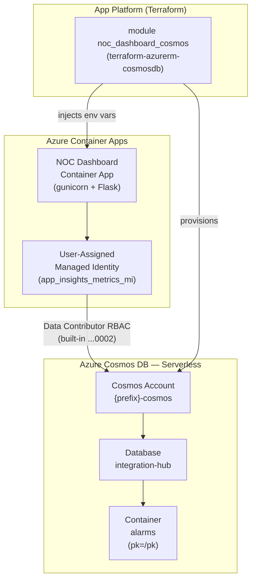
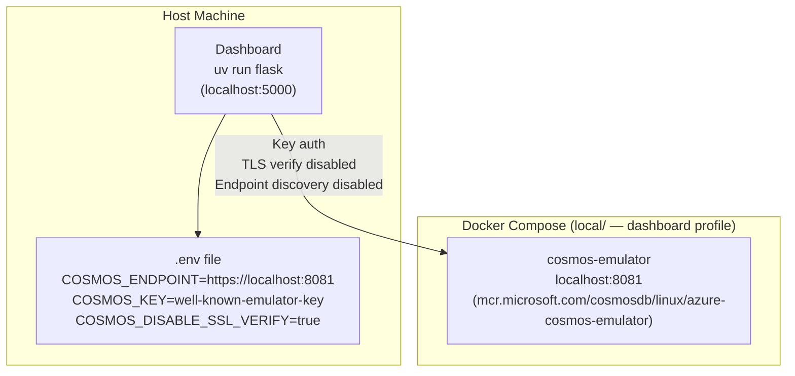
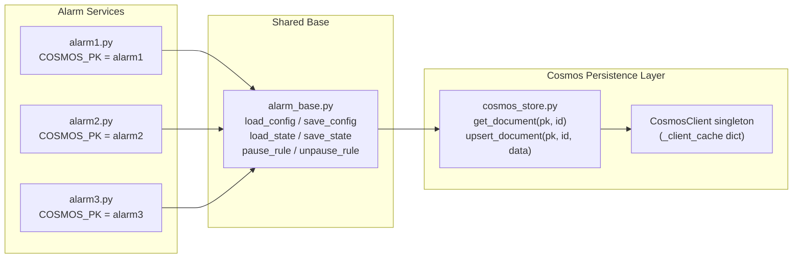
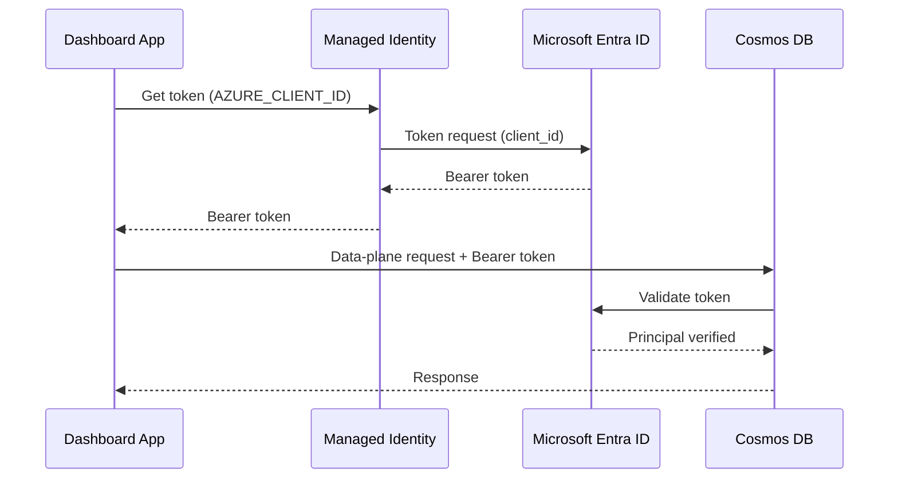
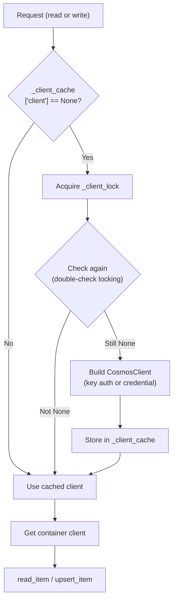
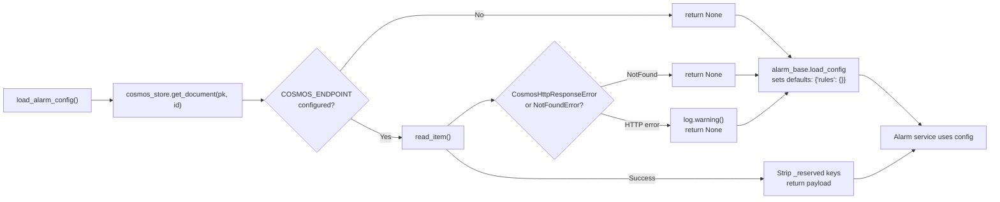

# Technical Design — Dashboard Data Persistence (Azure Cosmos DB)

**Story:** NOC Dashboard — Alarm Config & State Persistence  
**Component:** `dashboard/`  
**Status:** Implemented (feature branch merged to main)

---

## 1. Problem Statement

The NOC monitoring dashboard manages three alarm services (Alarm 1 — workflow inactivity, Alarm 2 — DLQ depth, Alarm 3 — exception rate). Prior to this story, alarm configuration (thresholds, rules) and runtime state (last-fired timestamps, manual pauses) were persisted as JSON files on the container's local filesystem.

**Problems with the JSON-file approach:**

- Files are lost on every container restart or new revision deployment — alarms must be reconfigured by hand after every deploy.
- Multiple Gunicorn workers race on the same file with no concurrency control.
- No persistence across horizontal scale-out.
- Files are inaccessible for inspection or audit without `exec`-ing into the container.

---

## 2. Solution Overview

Replace JSON-file persistence with **Azure Cosmos DB (NoSQL / SQL API)**, using:

- A single Cosmos account per environment, serverless capacity mode.
- One database (`integration-hub`) containing one container (`alarms`).
- Six documents total — a `config` and a `state` document for each of the three alarm services, partitioned by alarm namespace (`alarm1`, `alarm2`, `alarm3`).
- Authentication via **Managed Identity data-plane RBAC** in cloud environments; account-key auth (well-known emulator key) for local development.
- **Graceful degradation** — when `COSMOS_ENDPOINT` is not set, all persistence is silently skipped. Alarm pages render with empty defaults rather than crashing.

---

## 3. Architecture Diagrams

### 3.1 Cloud Architecture



### 3.2 Local Development Architecture



### 3.3 Persistence Layer — Module Structure



---

## 4. Data Model

### 4.1 Container Layout

| Property | Value |
|---|---|
| Account API | SQL (Core / NoSQL) |
| Database | `integration-hub` |
| Container | `alarms` |
| Partition key | `/pk` |
| Capacity | Serverless |

### 4.2 Document Schema

Each alarm has two documents stored in its partition:

```
Partition: alarm1
├── config  { "id": "config", "pk": "alarm1", "rules": { ... } }
└── state   { "id": "state",  "pk": "alarm1", "rules": { ... } }

Partition: alarm2
├── config  { "id": "config", "pk": "alarm2", "rules": { ... } }
└── state   { "id": "state",  "pk": "alarm2", "rules": { ... } }

Partition: alarm3
├── config  { "id": "config", "pk": "alarm3", "rules": { ... } }
└── state   { "id": "state",  "pk": "alarm3", "rules": { ... } }
```

**Example — Alarm 1 config document:**

```json
{
  "id": "config",
  "pk": "alarm1",
  "rules": {
    "phw-to-mpi": {
      "alarm_enabled": true,
      "workflow_id": "phw-to-mpi",
      "day_threshold_minutes": 60,
      "evening_threshold_minutes": 120,
      "weekend_threshold_minutes": 240,
      "alerting_gap_minutes": 60
    }
  }
}
```

**Example — Alarm 1 state document:**

```json
{
  "id": "state",
  "pk": "alarm1",
  "rules": {
    "phw-to-mpi": {
      "last_alarm_at": "2026-07-24T09:30:00+00:00",
      "paused_until": null,
      "pause_reason": null
    }
  }
}
```

Cosmos system fields (`_rid`, `_etag`, `_ts` etc.) and routing keys (`id`, `pk`) are stripped from documents when returned to callers, so alarm services interact only with the payload they stored.

---

## 5. Authentication

### 5.1 Cloud (Production / All Environments)



- `COSMOS_KEY` is **not set** in cloud environments — this forces `DefaultAzureCredential` / `ManagedIdentityCredential` path.
- `local_authentication_disabled = true` on the Cosmos account, enforcing AAD-only access.
- The dashboard's user-assigned managed identity (`app_insights_metrics_mi`) is granted the built-in **Cosmos DB Built-in Data Contributor** role (`...0002`) via `azurerm_cosmosdb_sql_role_assignment` in Terraform.
- Additional principals (e.g. developer object IDs for DEV/TST) can be added via `noc_dashboard_cosmos_data_contributor_principal_ids` in the environment tfvars.

> **Important:** Cosmos data-plane RBAC does **not** resolve Entra group membership. Role assignments must be to individual user/SP/MI object IDs, not group IDs.

### 5.2 Local Development (Emulator)

- `COSMOS_KEY` is set to the well-known emulator key (not a secret — published by Microsoft).
- `COSMOS_DISABLE_SSL_VERIFY=true` disables TLS certificate verification (emulator uses self-signed cert) **and** disables endpoint discovery (required because the Dockerised emulator advertises its internal container IP which the host cannot reach).
- The client is pinned to `localhost:8081`.

---

## 6. Singleton Client Pattern



The `CosmosClient` is created **once per process** and reused. The SDK manages its own connection pool internally. Thread-safety is ensured via a `threading.Lock` with double-check locking to prevent duplicate creation under concurrent Gunicorn worker startup.

A module-level `dict` (`_client_cache`) is used instead of a reassigned module global to satisfy the `ruff PLW0603` no-global-statements rule.

---

## 7. Graceful Degradation

All persistence operations follow the principle that a Cosmos outage must never crash or degrade a dashboard page load.



Errors at every layer — client initialisation, container access, read, and write — are caught, logged, and returned as `None` / silently skipped. The alarm services always receive a valid (possibly empty) config/state dict.

---

## 8. Terraform Infrastructure

### 8.1 Module

The Cosmos account, database, container, and RBAC assignments are encapsulated in the reusable module `modules/terraform-azurerm-cosmosdb`.

| Resource | Type |
|---|---|
| Cosmos account | `azurerm_cosmosdb_account` |
| SQL database | `azurerm_cosmosdb_sql_database` |
| SQL container | `azurerm_cosmosdb_sql_container` |
| Data Contributor role assignment | `azurerm_cosmosdb_sql_role_assignment` (×N) |
| Data Reader role assignment | `azurerm_cosmosdb_sql_role_assignment` (×N) |

### 8.2 Feature Flag

Cosmos provisioning is gated by a boolean variable in `components/app-platform`:

```hcl
variable "deploy_noc_dashboard_cosmos" {
  type    = bool
  default = false
}
```

This means existing environments are **unaffected** until they opt in by setting `deploy_noc_dashboard_cosmos = true` in their tfvars file. The feature also requires `deploy_noc_dashboard = true`.

### 8.3 Environment Variable Injection

When the Cosmos module is enabled, the following environment variables are automatically appended to the dashboard Container App's env list:

| Variable | Value |
|---|---|
| `COSMOS_ENDPOINT` | Account URI (from module output) |
| `COSMOS_DATABASE` | `integration-hub` |
| `COSMOS_CONTAINER` | `alarms` |
| `COSMOS_DISABLE_SSL_VERIFY` | `false` |

`COSMOS_KEY` is **intentionally omitted** — the app authenticates via Managed Identity.

### 8.4 Capacity and Cost

- **Serverless** capacity mode: no provisioned RU/s, billed per 100 request units consumed.
- At the expected workload (a handful of reads/writes per page load, a few times per minute) the monthly cost is negligible (pennies).
- No geo-redundancy required for this workload — single-region write only.

---

## 9. Testing

### 9.1 Unit Tests

`dashboard/tests/test_cosmos_store.py` covers `cosmos_store.py` with the `azure-cosmos` SDK fully mocked.

**Test isolation:** A `conftest.py` autouse fixture in `dashboard/tests/` patches `COSMOS_ENDPOINT = ""` for all tests. This prevents any test from attempting a real network connection (particularly important because `dashboard/.env` may set `COSMOS_ENDPOINT` pointing at the local emulator or a cloud account).

### 9.2 Local Integration

The Cosmos emulator is included in the shared Docker Compose stack:

```bash
# Start the emulator only
cd local
docker compose --profile dashboard up -d cosmos-emulator

# Run the dashboard against it
cd dashboard
uv run flask --app dashboard.app run
```

The emulator auto-creates the database and container on first use (key-auth path triggers `create_database_if_not_exists` / `create_container_if_not_exists`).

---

## 10. Configuration Reference

| Environment Variable | Required | Default | Description |
|---|---|---|---|
| `COSMOS_ENDPOINT` | No | _(empty)_ | Cosmos account URI. Empty disables persistence. |
| `COSMOS_KEY` | No | _(empty)_ | Account key. Empty → Managed Identity RBAC. |
| `COSMOS_DATABASE` | No | `integration-hub` | Database name. |
| `COSMOS_CONTAINER` | No | `alarms` | Container name. |
| `COSMOS_DISABLE_SSL_VERIFY` | No | `false` | Must only be `true` for the local emulator. |

---

## 11. Security Considerations

| Concern | Mitigation |
|---|---|
| Credential management | No account key in cloud — Managed Identity only. Key used only for local emulator (well-known, non-secret value). |
| AAD authentication | `local_authentication_disabled = true` on Cosmos account prevents any key-based access in cloud. |
| TLS | Verification disabled **only** when endpoint is `localhost`/`127.0.0.1`/`cosmos-emulator`. Any attempt to disable it against a non-local endpoint is rejected with an error log. |
| Data-plane RBAC | Minimum privilege: dashboard MI granted Data Contributor only. No management-plane access. |
| Network exposure | `public_network_access_enabled` controlled per environment via tfvars. Private endpoint supported (recommended for production). |
| Secrets in code | Zero — all config via environment variables, no hardcoded values. |
