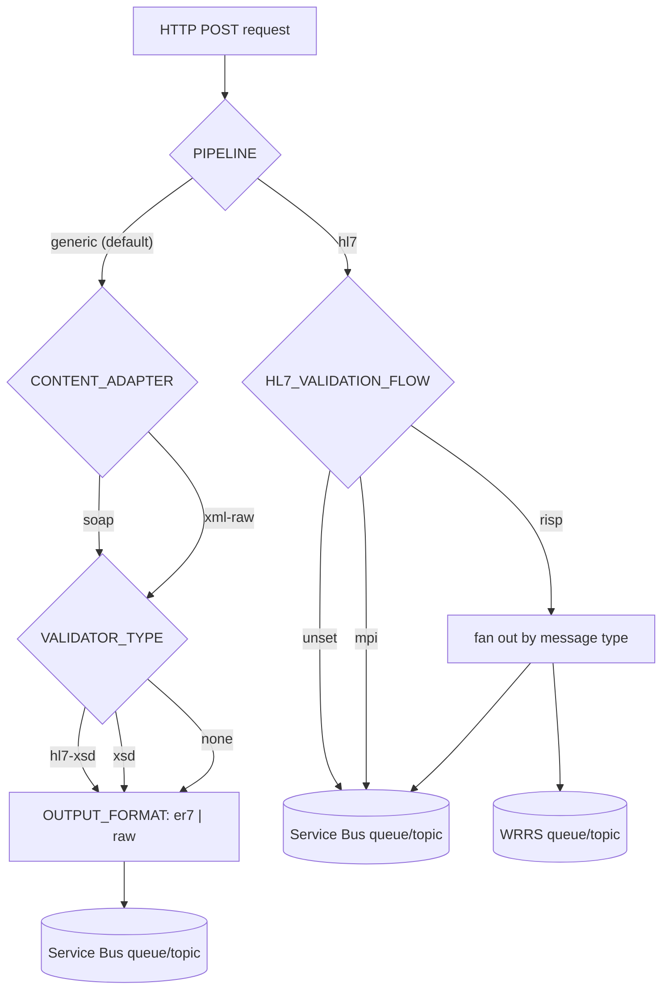
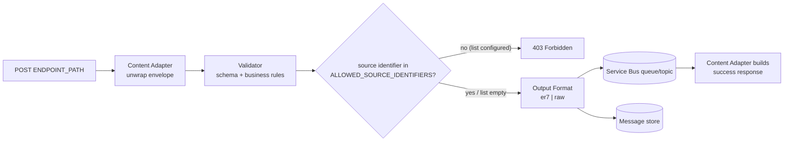
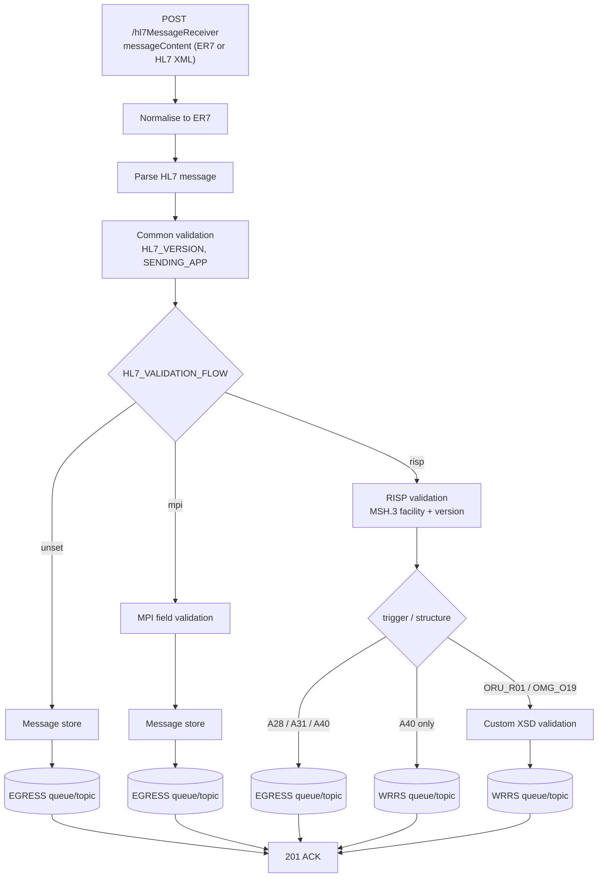

# REST server

A configurable HTTP/REST ingestion server with two selectable pipelines (`PIPELINE` env var):

- `generic` (default) - unwraps a POST payload with a configurable **content adapter**, validates
  it with a configurable **validator**, and forwards the validated payload downstream over Azure
  Service Bus.
- `hl7` - accepts HL7 v2 messages as JSON (`{"messageContent": "..."}`, ER7 or HL7 v2 XML),
  validates them (version/sending-app/flow-specific rules, including RISP's multi-destination
  fan-out), and returns a raw HL7 ACK/NACK - ported from the retired `hl7_rest_server` service.

Both pipelines reuse the same shared-library ingestion pipeline as
[`hl7_server`](../hl7_server/README.md) (Service Bus publish, message store, event logging,
metrics, health check).

This service is intentionally generic: the same image can be deployed multiple times, each
instance configured (via environment variables only) for a different sending system, payload
shape and destination queue. See
[`docs/REST_INGESTION_SERVER_PROPOSAL.md`](../docs/REST_INGESTION_SERVER_PROPOSAL.md) and
[`docs/rest_merge.md`](../docs/rest_merge.md) for the background design proposals.

`hl7_soap_server` remains the dedicated SOAP+HL7-v2.xml service for now (it also serves a WSDL
contract) - see [`docs/rest_merge.md`](../docs/rest_merge.md) §9 for its planned consolidation into
the `generic` pipeline (`CONTENT_ADAPTER=soap`, `VALIDATOR_TYPE=hl7-xsd`), which already reproduces
its behaviour.

## Choosing a configuration

Every running instance is one image configured for exactly one job via environment variables.
Start from `PIPELINE`, then pick the content adapter/validator (`generic`) or flow
(`hl7`) that matches your source system:



See [Configuration recipes](#configuration-recipes) (`generic`) and
[Configuration recipes](#configuration-recipes-1) (`hl7`) below for copy-paste environment
variable blocks for each case.

## What the `generic` pipeline does

- Accepts an HTTP POST on a configurable endpoint path (`ENDPOINT_PATH`).
- Unwraps the request body using the configured **content adapter** (`CONTENT_ADAPTER`):
  - `soap` - unwrap a SOAP 1.1 envelope and take the single `Body` child element (same logic as
    `hl7_soap_server`).
  - `xml-raw` - treat the whole request body as the business payload XML (no envelope).
- Validates the extracted payload using the configured **validator** (`VALIDATOR_TYPE`):
  - `hl7-xsd` - validate against an HL7 v2.xml structure schema (`VALIDATION_SCHEMA` = schema
    group, e.g. `phw`), same as `hl7_soap_server`.
  - `xsd` - validate against an arbitrary XSD file (`VALIDATION_SCHEMA` = file path).
  - `none` - skip schema validation (still subject to size limits and well-formedness checks).
- Optionally enforces a source allow-list (`ALLOWED_SOURCE_IDENTIFIERS`), where the source
  identifier is located in the payload via `SOURCE_IDENTIFIER_LOCATOR`.
- Formats the outbound payload (`OUTPUT_FORMAT`): `er7` (convert HL7 XML to ER7) or `raw` (publish
  the validated payload unchanged).
- Publishes to the configured Service Bus queue/topic and persists to the message store.
- Returns a response built by the same content adapter (SOAP success/fault envelope for `soap`,
  simple XML ack/error for `xml-raw`).



### Configuration recipes

**SOAP + HL7 v2.xml, same rules as `hl7_soap_server`** (e.g. LIMS → MPI):

```bash
PIPELINE=generic
ENDPOINT_PATH=/soap
CONTENT_ADAPTER=soap
VALIDATOR_TYPE=hl7-xsd
VALIDATION_SCHEMA=phw
ALLOWED_HL7_STRUCTURES=ADT_A05,ADT_A39
ALLOWED_SOURCE_IDENTIFIERS=328
OUTPUT_FORMAT=er7
```

**Plain XML (no envelope) validated against a partner-specific XSD:**

```bash
PIPELINE=generic
ENDPOINT_PATH=/ingest
CONTENT_ADAPTER=xml-raw
VALIDATOR_TYPE=xsd
VALIDATION_SCHEMA=/schemas/partner.xsd
SOURCE_IDENTIFIER_LOCATOR=Header/SourceSystem
MESSAGE_CONTROL_ID_LOCATOR=Header/MessageId
OUTPUT_FORMAT=raw
```

**Plain XML, no schema validation** (only use this with an explicit, documented justification -
see [Security](#security)):

```bash
PIPELINE=generic
ENDPOINT_PATH=/ingest
CONTENT_ADAPTER=xml-raw
VALIDATOR_TYPE=none
OUTPUT_FORMAT=raw
```

## What the `hl7` pipeline does

- Accepts a JSON POST body (`{"messageContent": "..."}`) on `POST /hl7MessageReceiver`, where
  `messageContent` is either a raw ER7 (pipe-and-hat) HL7 message or an HL7 v2 XML document.
- Validates HL7 version (`HL7_VERSION`) and sending application (`SENDING_APP`), plus optional
  flow-specific rules (`HL7_VALIDATION_FLOW=mpi|risp`) and standard-schema validation
  (`HL7_VALIDATION_STANDARD`).
- For the `risp` flow, fans a single inbound message out to up to two destinations: the configured
  `EGRESS_QUEUE_NAME`/`EGRESS_TOPIC_NAME` (as ER7) and/or `WRRS_QUEUE_NAME`/`WRRS_TOPIC_NAME` (as
  HL7 v2 XML), depending on message type.
- Publishes to Service Bus and persists to the message store, then returns a raw HL7 ACK (`201`,
  `MSA|AA|...`) or NACK (`422` validation failure, `400` oversize/malformed, `500` unparsable/
  internal error).
- Also exposes `GET /hl7MessageReceiver/ping` (liveness) and `GET /hl7MessageReceiver/status`
  (readiness), and gates Swagger/OpenAPI (`/docs`, `/redoc`, `/openapi.json`) to `DEV`/`SIT`
  (`ENVIRONMENT` env var) - unlike the `generic` pipeline, which keeps docs always-on.

The `risp` flow is the one case complex enough to warrant its own diagram: a single inbound
message can fan out to up to two destinations, in different formats, depending on message type:



Any validation failure (common, MPI-specific or RISP-specific) short-circuits before any send and
returns a `422` NACK instead - no partial/undone sends need to be rolled back.

### Configuration recipes

**Plain HL7 receiver, no flow-specific rules:**

```bash
PIPELINE=hl7
ENVIRONMENT=DEV
HL7_VERSION=2.5
SENDING_APP=252
```

**MPI outbound flow** (validates MSH.9.2/PID.2 fields, single destination):

```bash
PIPELINE=hl7
ENVIRONMENT=DEV
HL7_VALIDATION_FLOW=mpi
```

**RISP flow** (multi-destination fan-out - see diagram above):

```bash
PIPELINE=hl7
ENVIRONMENT=DEV
HL7_VALIDATION_FLOW=risp
EGRESS_QUEUE_NAME=pre-risp-transform
EGRESS_SESSION_ID=risp-to-mpi
WRRS_QUEUE_NAME=risp-to-wrrs
WRRS_EGRESS_SESSION_ID=risp-to-wrrs
WRRS_WORKFLOW_ID=risp-to-wrrs
```

## API contract

Built on [FastAPI](https://fastapi.tiangolo.com/), so every running instance publishes an accurate,
self-describing API contract for its own configuration:

- `POST <ENDPOINT_PATH>` (default `/ingest`) - accepts an XML request body (`Content-Type` matches
  the configured content adapter: `text/xml` for `soap`, `application/xml` for `xml-raw`) and
  returns the same content type on success or failure.
- `GET /docs` - interactive Swagger UI for this instance, showing the configured endpoint path,
  accepted content type, and response codes (`200`, `400`, `403`, `413`, `500`).
- `GET /openapi.json` - the raw OpenAPI 3 schema (also available via `GET /redoc`).
- `GET /health` - basic liveness check (the Container Apps health probe still uses the separate
  `HEALTH_CHECK_HOST`/`HEALTH_CHECK_PORT` TCP check, unchanged from `hl7_server`/`hl7_soap_server`).

## Development

### Dependencies

- [uv](https://docs.astral.sh/uv/)

### Install and run checks

From [rest_server](.) run:

```bash
uv sync
bash check.sh
```

### Run tests

```bash
uv run python -m unittest discover tests
```

### Local testing with a `.env` file

Copy [`.env.example`](.env.example) to `.env` and fill in values for the profile you want to test
(`.env` is gitignored, so real values never get committed). It is loaded automatically on startup
via `python-dotenv` and only fills in variables not already set in the real environment - so it
never affects production containers (which never have a `.env` file baked in) and never overrides
values a shell/pipeline has already exported.

```bash
cp .env.example .env
# edit .env, then:
uv run python -m rest_server
```

## Running the server

### Key environment variables

Shared with `hl7_soap_server` (unchanged names/behaviour):

- `HOST` (default `0.0.0.0`), `PORT` (default `8080`)
- `PIPELINE` - `generic` (default) | `hl7`
- `MAX_REQUEST_SIZE_BYTES` (default `1048576`; `-1` enforces the Azure Service Bus 100MB ceiling
  instead of the default - not truly unbounded)
- `TLS_CERT_FILE` and `TLS_KEY_FILE` (optional; enable in-process HTTPS when both set)
- `SERVICE_BUS_CONNECTION_STRING` or `SERVICE_BUS_NAMESPACE`
- `EGRESS_QUEUE_NAME` or `EGRESS_TOPIC_NAME` (exactly one required)
- `EGRESS_SESSION_ID`, `MESSAGE_STORE_QUEUE_NAME`, `WORKFLOW_ID`, `MICROSERVICE_ID`
- `HEALTH_BOARD`, `PEER_SERVICE`, `HEALTH_CHECK_HOST`, `HEALTH_CHECK_PORT`

### `generic` pipeline configuration (all required unless a default is shown)

- `ENDPOINT_PATH` - request path this instance listens on (default `/ingest`)
- `CONTENT_ADAPTER` - `soap` | `xml-raw`
- `VALIDATOR_TYPE` - `hl7-xsd` | `xsd` | `none`
- `VALIDATION_SCHEMA` - required when `VALIDATOR_TYPE` is `hl7-xsd` (schema group, e.g. `phw`) or
  `xsd` (XSD file path)
- `ALLOWED_HL7_STRUCTURES` - only used by the `hl7-xsd` validator (default `ADT_A05,ADT_A39`)
- `ALLOWED_SOURCE_IDENTIFIERS` - optional comma-separated allow-list; when unset, no source-based
  allow-list is enforced (compensate with network controls - see Security below)
- `SOURCE_IDENTIFIER_LOCATOR` - only used by the `xml-raw` adapter; slash-separated path of local
  element names locating the source identifier, e.g. `Header/SourceSystem`
- `MESSAGE_CONTROL_ID_LOCATOR` - only used by the `xml-raw` adapter; slash-separated path locating
  a message/control identifier used for Service Bus message ID and the response body
- `OUTPUT_FORMAT` - `er7` (convert HL7 XML payload to ER7 before publishing) | `raw` (publish the
  validated payload unchanged)

These five are only valid when `PIPELINE=generic` - setting any of `CONTENT_ADAPTER`,
`VALIDATOR_TYPE` or `OUTPUT_FORMAT` while `PIPELINE=hl7` is a startup error, not a silent no-op.

### `hl7` pipeline configuration

- `ENVIRONMENT` - `DEV`/`SIT`/... - gates Swagger UI (`/docs`, `/redoc`, `/openapi.json`)
- `HL7_VERSION` - expected inbound HL7 version (optional)
- `SENDING_APP` - expected inbound sending application, comma-separated allow-list (optional)
- `HL7_VALIDATION_FLOW` - `mpi` | `risp` | unset
- `HL7_VALIDATION_STANDARD` - HL7 standard version for structural validation (optional)
- `WRRS_QUEUE_NAME` / `WRRS_TOPIC_NAME`, `WRRS_EGRESS_SESSION_ID`, `WRRS_WORKFLOW_ID` - required
  only when `HL7_VALIDATION_FLOW=risp`

### Run locally

```bash
uv run python -m rest_server
```

Then browse to `http://<HOST>:<PORT>/docs` for the Swagger UI.

### HTTPS note

Container Apps can terminate HTTPS at ingress. If required for local in-process TLS, set both
`TLS_CERT_FILE` and `TLS_KEY_FILE` (passed to uvicorn as `ssl_certfile`/`ssl_keyfile`).

## Security

- There is **no application-level caller authentication** by default. TLS proves the server's
  identity and encrypts transport, not the caller's identity - compensate with network controls
  (private ingress, source-IP allow-listing) and consider `ALLOWED_SOURCE_IDENTIFIERS` as a
  secondary, payload-derived check only.
- All XML parsing uses `defusedxml` (DTD/external entity resolution disabled) to protect against
  XXE (OWASP A05).
- `MAX_REQUEST_SIZE_BYTES` is enforced before parsing to protect against oversized payloads.
- Treat every payload as untrusted: `VALIDATOR_TYPE=none` removes the schema trust boundary and
  should only be used with an explicit, documented justification for that instance.
